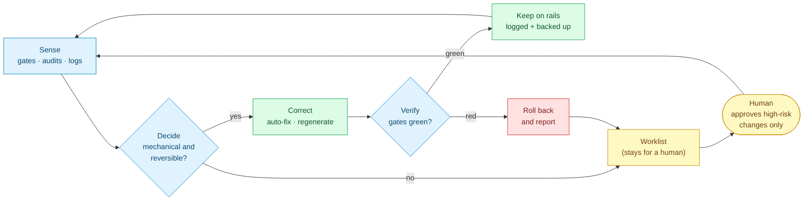
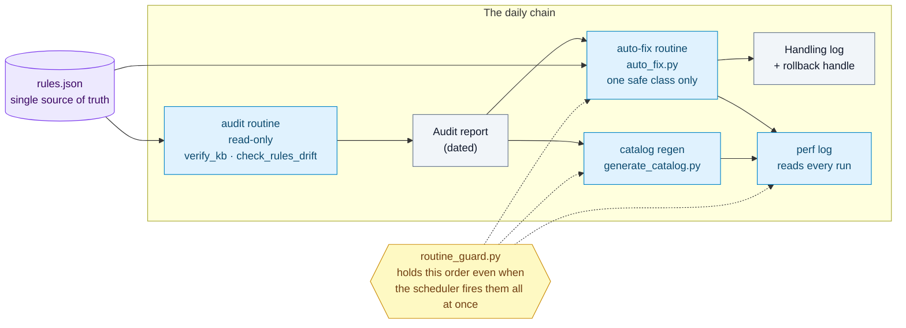

# Harness KB

**A blueprint for building a knowledge base that maintains itself.**

[](./LICENSE)
[](./CHANGELOG.md)
[](./docs/blueprint.md)
[](#dependencies)

> Most "second brains" rot. When an AI agent relies on your knowledge base, rot becomes
> a correctness problem: stale indexes, contradictory rules, and broken links quietly make
> the agent miss data. At scale, you cannot hand-maintain your way out of this.
>
> **Harness KB** is a blueprint plus a lifecycle-safe scaffold for a KB that keeps
> *itself* correct, fresh, and fast to retrieve. An agent can read this repository and
> build a runnable harness in a clean folder; it is still transparent files and scripts,
> not a hosted app.
> Everything runs on the Python standard library, with [one deliberate exception](#dependencies).

_Provenance: this blueprint reflects a real working system as of **2026-07-25**. The concepts are
evergreen; any specific counts are illustrative snapshots, not live values._

---

## The one idea

A pile of dashboards where a human still fixes everything by hand is a **cockpit**, not a harness.

A real harness is a **closed control loop**: `sense deviation → decide → correct → verify → keep on
rails`, running with minimal human intervention.



The goal is to move the human from *operator* to *supervisor* — someone who approves the
high-risk changes and lets the system handle the mechanical, reversible ones on its own.

Read the full argument: **[docs/blueprint.md](./docs/blueprint.md)**.

---

## The 7-property scorecard

Use this to score any knowledge base honestly. Instrumentation and guardrails are the *easy*
half; the closed loop is what most systems never reach.

| Property | Question it answers |
|---|---|
| **Actuation** | Can the agent act on the KB at all? |
| **Observability** | Is every action logged and visible? |
| **Guardrails** | Is damage prevented before it happens? |
| **Determinism / self-healing** | Do entry points recover instead of corrupt? |
| **Automation** | Does routine work run without a human? |
| **Multi-agent coordination** | Do multiple agents share state safely? |
| **Closed control loop** | Does the system correct itself, or only report? |

---

## What's inside

```
harness-kb/
├── AGENTS.md                      Multi-agent source of truth for contributors
├── CLAUDE.md                      Thin pointer to AGENTS.md
├── docs/
│   └── blueprint.md              The architecture: scorecard, loop diagnosis, roadmap, safety
├── scaffold/
│   ├── release.json              Installable components, ownership, gates, migration impact
│   ├── AGENTS.md + CLAUDE.md      Generic target-vault entrypoints (main + thin pointer)
│   └── rules.json + gates.json    A vault-owned starting contract, not demo data
├── examples/
│   ├── rules/rules.example.json  Single source of truth for tags/areas (the H1 pattern)
│   ├── scripts/verify_kb.py      Integrity gate — the "verify" step of the loop
│   ├── scripts/test_verify_kb.py Break-the-gate tests, incl. the frontmatter-validity case
│   ├── scripts/check_rules_drift.py  Documents vs. the source of truth — kills rule drift (H1)
│   ├── scripts/test_drift_check.py   Break-the-gate tests for the drift checker
│   ├── scripts/auto_fix.py       Fixes the one safe class of drift — backup, gate, rollback (H2)
│   ├── scripts/test_auto_fix.py  Break-the-fixer tests, including a forced rollback
│   ├── scripts/generate_catalog.py  Triage catalog for agent retrieval — `--check` gates staleness
│   ├── scripts/worklist.py       Retrieval signals → stable, review-only proposals (H3)
│   ├── scripts/test_worklist.py  Break-the-worklist tests: thresholds, IDs, no auto-apply
│   ├── scripts/claim.py          Per-file lock so parallel agents can't clobber each other (H4)
│   ├── scripts/test_claim.py     Break-the-lock tests for the claim lock
│   ├── scripts/tooling_selfcheck.py  Runs your tooling's test suites — the gate that runs the gates
│   ├── scripts/test_tooling_selfcheck.py  Break-the-gate tests for that runner
│   ├── scripts/routine_guard.py  Orders scheduled routines by mechanism, not by cron spacing (H4b)
│   ├── scripts/test_routine_guard.py  Break-the-wait tests for that guard
│   ├── scripts/audit_gate.py     Refuses to end a turn while an audit is unclean (H4c)
│   ├── scripts/test_audit_gate.py  Break-the-gate tests, including "does it block too much?"
│   ├── scripts/derived_write_guard.py  A generator that refuses to shrink the artifact it owns
│   ├── scripts/test_derived_write_guard.py  Break-the-guard tests: the shrink, and blocking wrongly
│   ├── scripts/harness.py         Init, update check, upgrade plan/apply, backup and rollback
│   ├── scripts/test_harness.py    Two-vault black-box lifecycle and forced-rollback tests
│   ├── rules/gates.example.json  Which checkers the audit gate runs, and how to read them
│   ├── hooks/settings.json       Example hooks: activity log, claim lock, tooling gate
│   ├── routines/kb-audit-daily.SKILL.md  Template for a scheduled daily audit agent
│   └── routines/kb-autofix-daily.SKILL.md  Template for the auto-fix run that follows it
└── LICENSE
```

The example scripts remain readable **reference implementations**. The scaffold installs a pinned
subset inside the vault on purpose — not blindly: `.harness/manifest.json` records exact source
version/commit, ownership and a base hash for every component, so later change is a three-way
decision instead of an overwrite.

### How the pieces run, on an ordinary morning



Everything above is read-only except `auto_fix.py`, which is the only script here allowed to write
to your notes — and it is deliberately the narrowest one. `worklist.py` is the decision boundary:
it turns measurements into exact proposals but still leaves every semantic change to a reviewer.

## Dependencies

Python 3.8+. Every script here runs on the standard library alone, with **one exception**:

```bash
pip install pyyaml      # needed by verify_kb.py only
```

`verify_kb.py` uses PyYAML to answer one question its own parser must not be trusted with:
*is this note's frontmatter valid YAML at all?* Given `summary: "the "blank page" icon"` a
hand-rolled parser returns a perfectly plausible string, while Obsidian and every
spec-compliant reader see a note with **no title, no tags, no summary**. A gate that reads
frontmatter with a regex calls that note clean — and in the vault this blueprint is distilled
from, exactly that happened: two broken notes sat behind a green gate for days.

So the verdict goes to a real parser. And when PyYAML is missing, `verify_kb.py` does not
quietly skip the check and print a green line — it names the missing checker and **exits 2**:

| Exit | Meaning |
|---|---|
| `0` | clean |
| `1` | problems found |
| `2` | cannot certify — bad arguments, or a required checker is unavailable |

"Zero problems found" while a mandatory check did not run is not a clean result, it is an
unknown one. Collapsing those two into the same green light is the failure this repo argues
against, so the gate refuses to do it — even about itself.

## Quickstart

### Build an agent-ready vault

Clone this repository, then give the installer a clean target folder. The network choice is
required rather than implied: `--allow-network-checks` records consent for cached GitHub SemVer-tag
checks; use `--no-network-checks` for a permanently local install.

```bash
git clone https://github.com/chuong1224/harness-kb.git
python harness-kb/examples/scripts/harness.py init my-vault --allow-network-checks
cd my-vault
python .harness/harness.py verify .
```

That creates no demo notes and copies no repository history. It creates:

- `AGENTS.md` as the user-owned, multi-agent source of truth and a thin `CLAUDE.md` pointer;
- `.harness/manifest.json` with source repo, installed version and exact commit, plus ownership,
  base hash and installed hash for every component;
- in-vault gates, rules, coordination tooling and a per-vault lifecycle control plane;
- an optional Claude hook file whose claim and audit state is explicitly namespaced inside this
  vault, never shared with another vault on the same machine.

Run `python .harness/harness.py check .` at session start. A consented check reads the stable
SemVer tags that this repository actually publishes, uses a 24-hour per-vault cache, reports the
exact number of releases you are behind, and exits quietly without an offline warning if the
network is unavailable.

Upgrade is deliberately two commands, so review exists before mutation:

```bash
git -C harness-kb pull --ff-only
python .harness/harness.py plan . --source ../harness-kb
python .harness/harness.py apply . --plan .harness/plans/<reviewed-plan>.json
```

The plan shows changelog range, migration impact, user-owned files that will be preserved and any
upstream/local conflict. Apply backs up every touched path, refuses a stale plan, runs the new
gates, and restores the old bytes automatically if a gate is red. Its success output includes a
persistent `rollback --backup <id>` handle.

### Run individual reference tools

The scripts also run directly on any folder of Markdown notes (a "vault"). Python 3.8+; see
[Dependencies](#dependencies) for the single optional package.

```bash
# 1. Check integrity — the verify gate of the control loop
python examples/scripts/verify_kb.py /path/to/your/vault --rules examples/rules/rules.example.json

# 2. Check that your documents still agree with the source of truth (no rule drift)
python examples/scripts/check_rules_drift.py /path/to/your/vault --rules examples/rules/rules.example.json

# 3. Generate a triage catalog agents can read before searching
python examples/scripts/generate_catalog.py /path/to/your/vault --out catalog.json

# ...and gate it: exit 1 when the catalog no longer matches the notes
python examples/scripts/generate_catalog.py /path/to/your/vault --out catalog.json --check

# 4. See which agent stream currently holds which file (multi-agent lock, H4)
python examples/scripts/claim.py status --vault /path/to/your/vault

# 5. Run the test suites that guard your own in-vault tooling
python examples/scripts/tooling_selfcheck.py run --vault /path/to/your/vault
#    Its default outside-vault marker is isolated by the canonical vault root, so two
#    vaults on one host do not share coverage history. --state opts into sharing explicitly.

# 5b. It also counts each suite's assertions and blocks when that number falls. When the
#     drop is deliberate, lower the mark on the record instead of switching the gate off:
python examples/scripts/tooling_selfcheck.py accept --reason "merged two redundant cases" \
    --vault /path/to/your/vault

# 6. Let the machine fix the one class of drift it cannot get wrong (dry run first)
python examples/scripts/auto_fix.py /path/to/your/vault --rules examples/rules/rules.example.json
python examples/scripts/auto_fix.py /path/to/your/vault --rules examples/rules/rules.example.json --apply

# 7. Before a routine that consumes the audit: block until today's report exists (H4b)
python examples/scripts/routine_guard.py wait-report --report "/path/to/Audit Report.md"

# 8. Turn one retrieval-health snapshot into a stable, review-only worklist (H3)
python examples/scripts/worklist.py insight.json --out worklist.json

# 9. Run every gate you own and report only what is NEW since the last clean run (H4c)
python examples/scripts/audit_gate.py run --vault /path/to/your/vault \
       --config examples/rules/gates.example.json

# 10. Let a generator refuse to overwrite its own output with fewer rows than it already has
python examples/scripts/derived_write_guard.py --ledger ledger.json --out log.md
```

> **Put these scripts inside the vault they serve.** A machine with the notes but without the tools
> cannot verify or regenerate anything, and a second copy kept in per-machine config drifts from the
> first with no audit able to see it. That failure grows with every machine you add — blueprint §5.
> The `init` command above is the reproducible way to do that: it installs a declared component set
> and keeps provenance instead of asking a user or agent to copy an informal list by hand.
>
> Then note what the move costs: the generator can now run on machines whose *state* stayed behind,
> where it will happily rewrite a shared artifact with a fraction of its history and exit 0. Step 10
> is that guard — the port is not finished until the tool can refuse.

Wire `claim.py` into a `PreToolUse` hook ([examples/hooks](./examples/hooks)) and the lock stops
being advice: a write to a file another stream is editing is **blocked**, not merely discouraged.
It claims free files silently, so a single agent never notices it. Wire `tooling_selfcheck.py` into
the `Stop` hook and the same becomes true of your tests: edit a tool, and its suite runs before the
turn is allowed to end — because a gate nobody runs is not a gate.

`audit_gate.py` finishes that thought for *every* checker you own. Wired into the `Stop` hook, it
runs them and refuses to let the turn end while something is broken. The hard part is not blocking —
it is **not blocking too much**. A guard that jails a session over a red lamp somebody else lit gets
switched off within the week, so this one compares the *set of findings* against a stored baseline
and blocks only on what is new. Inherited findings are printed on every run but never block, and a
finding that genuinely is not yours is adopted with a recorded reason — `accept --why "…"` — rather
than by disabling the guard. Its default machine-local baseline is also namespaced by a stable hash
of the canonical vault root, so accepting debt in one vault cannot silence the same finding in a
second vault on that machine. An explicit `--state` path still means intentional sharing.

`auto_fix.py` is the only script here that writes to your notes, and it is deliberately the
narrowest one: it rewrites a **number on a line that carries a marker**, nothing else. It refuses
the fix whenever the checker's report and its own re-read of that line disagree, backs up every
file it touches, re-runs both gates afterwards, and rolls the whole run back if either goes red.
Incomplete enumerations, removed markers and anything semantic stay in the report for a human —
widening that list should be a decision, not a flag.

**A marker owns the text before it.** Put as many markers on a line as you like: the checker reads
each number inside the segment running from the previous marker up to this one, so a total and a
subset written as "N tags" twice on one line are attributed correctly and the fixer rewrites each in
its own slot. (Earlier versions matched patterns across the whole line and handed both markers the
leftmost number — the report was wrong before the fixer ever saw it, and the fixer had to refuse
such lines. Lines carrying a single numeric marker still read the whole line, so nothing forces you
to put the marker right after the number.)

Both checkers exit `0` when clean and `1` when they find problems — so you can wire them into a
commit hook or a scheduled job as a hard gate. Point them at `examples/demo-vault` to see real
output immediately: zero errors, plus a few warnings, because the example rules deliberately declare
more areas and tags than the six-note demo actually uses — which is exactly the signal you want when
a vocabulary entry stops being used.

---

## Tiếng Việt

**Bản thiết kế cho một knowledge base tự bảo trì.**

Phần lớn "bộ não thứ hai" đều mục theo thời gian. Khi một AI agent dựa vào KB của bạn, sự mục
nát trở thành vấn đề *tính đúng*: index lỗi thời, quy tắc mâu thuẫn, link gãy — âm thầm khiến
agent **sót dữ liệu**. Ở quy mô lớn, không thể bảo trì tay mãi được.

**Harness KB** là một blueprint nhỏ kèm bộ dựng có vòng đời an toàn, cho một KB tự giữ mình
**đúng — tươi — truy xuất nhanh**. Đây là các file và script minh bạch, không phải một app dịch vụ.

Một agent chỉ cần đọc repo rồi chạy `harness.py init` là dựng được vault có `AGENTS.md` làm luật
chính, `CLAUDE.md` mỏng dẫn vào đó, gate chạy thật và manifest ghi đúng phiên bản/commit đã cài.
Phía người dùng có kênh biết mình chậm bao nhiêu release; kiểm tra mạng phải được đồng ý trước,
có cache riêng từng vault và im lặng khi offline. Nâng cấp luôn tách `plan` khỏi `apply`: file do
người dùng sở hữu được giữ nguyên, file tooling bị sửa tay thành xung đột nhìn thấy được, mọi thay
đổi có backup, gate đỏ thì tự hoàn nguyên và lần nâng cấp thành công vẫn để lại lệnh rollback.

**Ý tưởng cốt lõi:** một đống dashboard mà người vẫn phải tự tay sửa mọi thứ = *buồng lái*,
chưa phải harness. Harness thật là một **vòng điều khiển khép kín**: cảm biến độ lệch → quyết
định → tự chỉnh → xác minh → giữ trên đường ray, với can thiệp người tối thiểu. Mục tiêu: đưa
con người từ *người vận hành* thành *người giám sát* chỉ phê duyệt thay đổi rủi ro cao.

**Khi nhiều agent dùng chung một vault:** đừng dựa vào luật "nhớ kiểm tra trước khi sửa" — đó là
khế ước xã hội, chỉ đúng tới lần đầu tiên một model quên. `claim.py` biến nó thành **khoá cơ học**:
hook chặn thẳng lệnh ghi khi stream khác đang giữ file, và im lặng khi bạn làm một mình.

**Một luật kiến trúc đáng nhớ:** script kiểm tra / sinh dữ liệu phải nằm **trong chính vault**, không
để trong thư mục cấu hình của từng máy. Máy có note mà thiếu công cụ thì không verify hay regen được
gì; bản sao thứ hai ở máy khác thì tự do lệch đi mà audit không thấy — vì audit chỉ quét vault. Hai
máy còn vá tay được; nhiều máy thì số bản sao tăng tuyến tính còn khả năng chúng khớp nhau thì
không. Phép thử: **clone vault sang máy trắng — chạy gate được không?**

**H3 đã có reference implementation:** `worklist.py` nhận đúng một snapshot sức khoẻ truy xuất,
chuyển nó thành đề xuất có ưu tiên, ID ổn định, đích và bằng chứng cụ thể, nhưng luôn giữ
`auto_apply: false`. Script không tự đo lại tín hiệu và không sửa, link, move hay merge note.

Chi tiết đầy đủ: **[docs/blueprint.md](./docs/blueprint.md)** (tiếng Anh).

---

## License

[MIT](./LICENSE) © 2026 Chuong Phan
