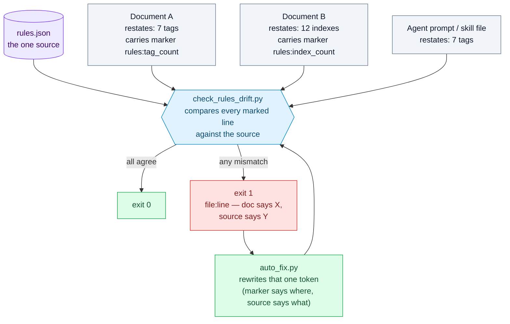
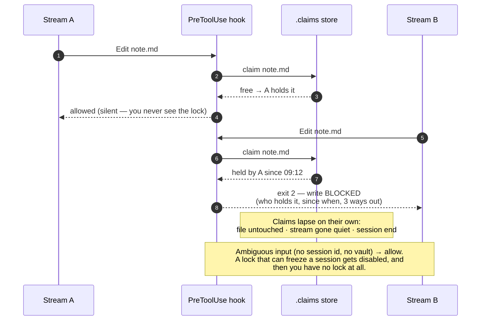
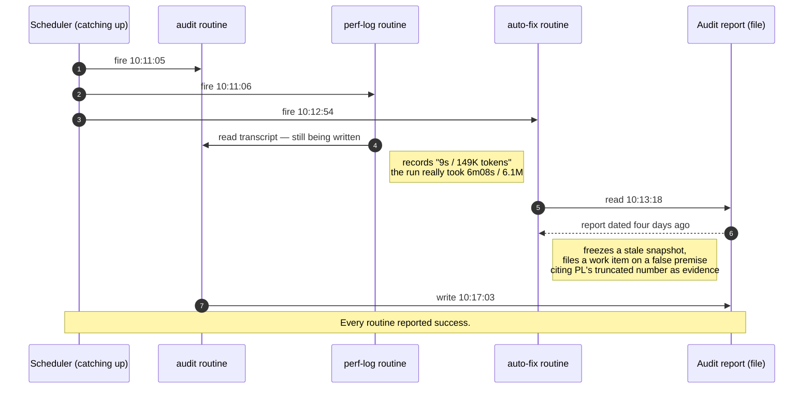
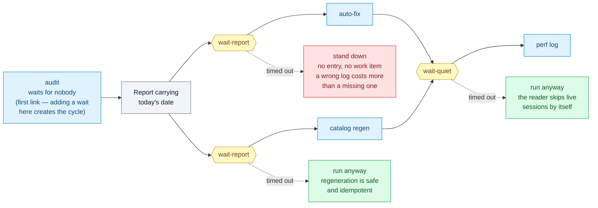

# The Self-Operating Knowledge Base — A Harness Blueprint

> This blueprint distills a working architecture for a knowledge base (KB) that maintains
> *itself*: correct, fresh, and fast for both humans and AI agents to retrieve from. It is
> deliberately tool-agnostic — the KB is just a folder of Markdown notes; the ideas apply
> whether you drive it with an editor, a script, or an autonomous agent.

*Provenance: this blueprint reflects a real working system as of **2026-07-25**. The concepts are
evergreen; any specific counts mentioned (e.g. tag or index totals) are illustrative snapshots
from that date, not live values.*

---

## 1. The goal: a KB that runs itself

**North star:** the KB preserves its own *correctness*, *freshness*, and *retrieval quality*
without a human steering every loop. The human becomes a *supervisor and approver of high-risk
changes*, not the *operator* of routine maintenance.

This is not automation for its own sake. It follows directly from the real goal of a KB an agent
depends on: **the agent must not miss data**. A KB whose rules contradict themselves, whose
indexes are stale, and whose links quietly break will lead an agent to triage wrongly and miss
what it needed. To guarantee "no missed data" as the KB grows, the quality-control loops must
**run and correct themselves** — they cannot depend on a human remembering to run them.

---

## 2. What "harness" really means

There are two senses of the word, and a maturing system sits at two different levels:

- **Sense 1 — agent scaffolding.** The runtime around a model: tools, permissions, hooks,
  feedback. Building a *second-order* harness on top of your agent runtime — activity logging,
  verification gates, coordination contracts — already puts you ahead of typical usage.
- **Sense 2 — the original sense (a harness on a powerful animal, a test harness, a safety
  harness).** The thing that makes a **powerful but unpredictable** engine **safe and reliably
  useful.** This is the level most systems never fully reach.

> **The defining property of a harness is not "many gauges." It is the CLOSED LOOP:**
> `sense deviation → decide → self-correct → verify → keep on rails`, running with minimal
> human intervention. A hundred dashboards where a human still fixes everything by hand is a
> **cockpit**, not a harness. A harness is when the system **pulls itself back onto the rails.**

---

## 3. The 7-property scorecard

Score any KB honestly. The first six properties are the *scaffolding*; the seventh is the
*essence*. Most effort — and most pride — goes into 1–6, which is exactly why 7 is the frontier.

| Property | What good looks like | Typical state |
|---|---|---|
| **Actuation** | Agent can read/write notes and run maintenance | Usually solved |
| **Observability** | Every action is logged and visible in real time | Often strong |
| **Guardrails** | Damage is prevented before it happens (gates, backups, safe entry points) | Often strong |
| **Determinism / self-healing** | Entry points are idempotent; a supervisor recovers from crashes | Achievable |
| **Automation** | Routine maintenance runs on a schedule without a human | Achievable |
| **Multi-agent coordination** | Multiple agents share the KB without clobbering each other | Usually by convention |
| **Closed control loop** | The system corrects itself; it does not only report | **Rarely reached** |

A common, honest self-assessment in a maturing system: near-complete on scaffolding and
guardrails, but only a fraction of the top-level loops actually close. You have built an excellent
*cockpit and safety rig*; what remains is letting the machine **hold itself on the rails**.

---

## 4. Diagnosing your loops: open vs. closed

For each maintenance concern, ask one question: **does it sense AND self-correct, or does it only
sense-and-report?** A loop that reports and stops is an *open* loop — a human is the final
actuator.

| Loop | Sensor | Self-corrects? | State |
|---|---|---|---|
| **Code/config changes** | test/self-check | Change → gate must pass → back up | Closed |
| **Retrieval catalog freshness** | note changes | Regenerate on schedule + on every edit | Closed |
| **Content integrity (audit)** | daily audit finds violations | Often intentionally read-only | **Half-open** |
| **Retrieval optimization** | metrics: re-reads, long chains, hot/cold notes | Nothing restructures automatically | **Open** |
| **Cost / performance** | per-run token/cost/time logs | Observe only | **Open** |

If most of your top-level loops sense-and-report, you have a cockpit. That is the line between
"a very rich instrumentation rig" and "a harness in the full sense."

The difference is one edge — the one that comes *back*:


Note what is *not* different: judgment still belongs to the human in both. Closing the loop does not
mean the machine decides more — it means the machine handles the cases where there was never a
decision to make.

---

## 5. The core architecture debt: a single source of truth

A recurring failure mode: **rules duplicated across many documents drift apart.** An audit that
checks the KB against its own rules will eventually catch its *rules* disagreeing with each other
— for example, one document might claim the tag vocabulary has 14 entries while another says 15,
or one counts 26 indexes and another 27. The audit catching the drift is good. But the drift **keeps recurring** because there
is no single generated source.

> **A real harness has exactly ONE source of truth.** Every countable, enumerable fact (the tag
> vocabulary, the number of indexes, the list of areas) is **generated from one source**;
> every other document *derives* from it — instead of five hand-copied versions slowly diverging
> and an audit chasing them every morning.

This is the highest-leverage, lowest-risk fix, and it is a prerequisite for safely automating any
*correction* (§6, §7). See `examples/rules/rules.example.json` for the data-as-source pattern and
`examples/scripts/verify_kb.py` for a gate that checks notes against that single source.



The documents keep showing the number — they just stop *owning* it. Without the marker, every one of
those boxes is an independent claim, and the audit's job degrades into comparing copies with copies.

### Documents may show the numbers - they just may not own them

The naive reading of "one source of truth" is to strip every count out of your prose. Do not: readers
and agents genuinely want "the vocabulary has 7 tags" in the document they are already reading. The
fix is not to delete the copy, it is to **stop letting the copy be authoritative**.

Mark each restating line with a comment naming the claim it makes:

```markdown
## Tag vocabulary (7 tags) <!-- rules:tag_count -->
## Index hierarchy (12 indexes) <!-- rules:index_count -->
```

The marker is an HTML comment: invisible when rendered, trivial to grep, and it survives editing by
humans and agents alike. A checker then reads each registered document, extracts the marked claims,
and compares them with the source - **policy** values as authored (vocabulary, areas) and
**filesystem** values as counted (index count). Drift is reported as `file:line`, so nobody has to
hunt for which of five copies is wrong. `examples/scripts/check_rules_drift.py` is a working
implementation; `examples/scripts/test_drift_check.py` breaks it on purpose to prove it catches drift.

Two properties matter more than the implementation:

- **The registry is explicit.** The rules file lists which documents restate which claims, so
  *deleting* a marker is itself an error. Drift cannot hide by removing the evidence.
- **Detection is separate from correction.** The checker never edits a document. It only makes the
  numbers impossible to break silently - which is exactly the precondition H2 needs before anything
  is allowed to rewrite them (§7, rule 4).

### The tooling has to live in the vault, not beside it

One source of truth applies to the *tools* as much as to the data. The tempting place to put a
generator or a checker is wherever your agent keeps its skills, or a config directory, or the folder
you happened to clone it into. All of those live **outside** the vault - and that single decision
quietly breaks three things at once:

- **The KB stops being self-sufficient.** A machine that has the vault but not the tool cannot
  regenerate the catalog or run the gate. Work done there silently degrades the KB: notes get added,
  derived artifacts go stale, and nobody notices until someone sits at the *other* machine.
- **The tool itself becomes a drift source.** Two machines, two copies, edited on different days.
  Same vault, two answers - and no way to tell which one is right.
- **It lands in the audit's blind spot.** The audit scans the vault. A checker outside the vault is,
  by construction, unchecked. We found a path constant that had been broken for a week inside exactly
  that gap: every session using it silently fell back to a slower, lossier retrieval route.

> **Rule: anything the KB needs in order to verify or regenerate itself belongs inside the KB**,
> versioned with the content it acts on, depending on nothing but a stock interpreter.

What may stay outside is narrow and specific: **secrets**, **large binaries**, and **per-machine
configuration** (paths, ports). A thin launcher or hook may live in machine config as long as it only
*calls into* the in-vault script and holds no logic of its own.

The scaling argument is the one that matters. With two machines you can patch by hand and remember
which is behind. At team or company scale, per-machine copies grow linearly while the chance that
they agree collapses: N machines is N chances for the gate to be missing, outdated, or subtly
different — and every one of those is invisible to an audit that only reads the vault. In-vault
tooling makes that class of failure structurally impossible instead of merely unlikely.

The test is blunt: **clone the vault onto a clean machine. Can you run the gate?** If the answer
requires installing something first, the tooling is in the wrong place.

One migration caveat, learned the hard way. When you move a generator into the vault, its output must
match the old one **field for field** — otherwise the two machines take turns rewriting the same
derived file and every sync becomes a diff. Port it, then run it in a compare mode against the
artifact the old tool produced and reconcile until only genuine content changes remain. Undocumented
conventions surface fast that way: slug truncation limits, whether headings include the H1, what a
missing frontmatter field defaults to.

### Moving a tool inside also hands it a new way to do damage

The section above is an argument for a move, so it is worth being explicit about what the move
costs — because the honest answer is not "nothing". A generator sitting in one machine's config
directory could only ever run *there*. Put it in the vault and every machine that syncs the vault
can now run it. That is the entire benefit, and it is also the whole risk, because such a generator
usually has two inputs and only one of them travels with it:

- the **derived artifact** it writes, which lives inside the vault and is therefore synced, shared,
  and read by everyone;
- its **accumulated state** — a ledger, a cursor, a cache of what it has already seen — which is
  per-machine and stays outside by the very exception the previous section grants. State is not
  configuration, but it is exactly as machine-local, and a write-heavy ledger inside a file-syncing
  folder buys you conflict copies rather than history.

Machine-local is a location, not a namespace. If one copy of the tool can serve several vaults on
the same host, key that outside state by the canonical vault root (or a stable hash of it), not by
hostname alone. Otherwise a demo vault can inherit a real vault's failures and test names, and the
next accepted or green demo run can overwrite the real coverage mark. Apply the same rule one level
down when several Python runtimes can run the same gate: an interpreter with all libraries present
must not stamp green for a venv that cannot import them. Key the default state by a stable runtime
identity as well as the vault, and record that identity inside an explicitly shared state so a
runtime change forces another measurement. An explicit `--state` remains an intentional escape
hatch for location; it must not turn a green result from one interpreter into evidence for another.

So the tool arrives on the second machine complete and runnable, and its memory arrives empty. Run
it there and it does precisely what it was written to do: render the artifact from the state it can
see. When we finished exactly this port, a run on the second machine would have replaced a 166-row
performance log with the three runs that machine happened to hold. No error, no traceback, exit 0,
a cheerful "wrote note" — and a hundred and sixty-three rows gone from the one file nobody
re-reads, because it is generated and therefore assumed to be regenerable.

Note what this is *not*. It is not the field-for-field mismatch of the previous paragraph, which
shows up as a diff on the next sync and annoys you until you fix it. This one leaves no diff to
notice: the file is exactly what the tool meant to write. And it is not fixed by being careful,
because "only run the generator on the machine that has the ledger" is a rule that lives in
somebody's head — the same class of guarantee this whole document exists to replace.

**The port is not finished until the tool can refuse.** Most accumulating generators have an
invariant sitting right there unused: *the record set only grows*. Ours unions by session id and
keeps rows whose source transcripts were cleaned up long ago, so its count can rise or hold, never
fall. Where such an invariant exists, the generator can check its own previous output before
overwriting it — the artifact already claims more records than this run would write, therefore this
run is not reading the state that produced it, therefore refuse and change nothing. One read of the
file you were about to clobber turns silent loss into a loud, specific stop.

Three properties decide whether that guard survives contact with a real morning:

- **Fail closed on shrink, fail open on doubt.** A missing artifact, or one whose count line cannot
  be parsed, is not evidence of loss — write anyway. A guard that blocks whenever it cannot parse
  something becomes an outage the first time somebody restyles the template, and an outage is
  visible in a way the loss never was, so it gets switched off and takes the real protection with it.
- **The escape hatch must be explicit, and forbidden to the routine.** Deliberate truncation is
  real: you merged ledgers, you rebuilt from scratch. So `--allow-shrink` has to exist — and the
  scheduled prompt that runs the tool has to be told, in its own instructions, that it may never
  add that flag to get past a refusal. A routine that retries with the override has automated the
  guard away, which is worse than not having written it, because now the stop is on record as
  handled.
- **The artifact must state its own count.** The check reads a number the generator itself wrote on
  the previous run, which is what makes it independent of any state the current machine holds. If
  your template has no such line, add one first; a generated file that says how much it contains is
  worth having regardless.

Reference implementation: `examples/scripts/derived_write_guard.py`, with
`examples/scripts/test_derived_write_guard.py` attacking both betrayals — letting the shrink
through, and blocking a first run, a restyle, or an ordinary growing run.

### A gate nobody runs is not a gate

Moving the tooling inside the vault raises the next question immediately: those scripts have tests —
**who runs them?** If the answer is "whoever remembers", you have written documentation, not a gate.
A suite nobody runs does not fail loudly; it stops being evidence, silently, and you discover months
later that the check you trusted has been vacuous for weeks.

Wire the suites to something the runtime already does. An end-of-turn hook works well: it is
frequent, it is automatic, and it is a natural place to refuse — *this turn is not finished while a
tool you just edited has a failing test.* `examples/scripts/tooling_selfcheck.py` is that gate, and
five properties are what make it survivable rather than merely strict:

- **Discover the suite, never list it.** Anything matching `attachments/test_*.py` is in. A list you
  must remember to append to is the same failure mode one level up — and hand-maintained file lists
  have already bitten this project twice.
- **Do nothing when nothing changed.** Fingerprint every tooling file (tools included — editing a
  tool invalidates yesterday's green run as much as editing its test) and compare against the last
  **green** run. The common path costs a fifth of a second, which is why nobody wants it removed.
- **A red run must not record success.** Otherwise the gate goes quiet immediately after the first
  failure, precisely when it should be loudest.
- **Fail open, and never trap.** Unknown input, no vault, runner crash → allow. Already blocked once
  this turn → report but let it end. A gate that can strand a session is a gate someone disables
  permanently, and then you have nothing.
- **Measure what the suite did, do not ask it.** A zero exit proves nothing was raised; it does not
  prove anything was checked. A suite that skips quietly — `if not condition: pass` — or that loses
  assertions to a careless edit still exits zero, and the gate stamps another green run over coverage
  that has evaporated. Have every suite print one line per assertion, count those lines, and compare
  the count against the last green run. A drop is an observable fact, so you never have to infer
  intent: deleting five cases and silently skipping five look identical from the outside. Leave an
  explicit way to lower the mark *with a stated reason* — a gate with no legitimate exit is a gate
  that gets switched off.

The bug that made all this concrete: an early version accepted `--vault` without validating it. A
mistyped path found no suites, reported green, and wrote a green marker — after which the gate stayed
silent forever. **The dangerous failure mode of a gate is not a false alarm, it is quiet
reassurance.** Test for that case explicitly.

And expect that lesson to come back one level up, because each gate you add creates a new quiet
channel above itself. Counting assertions catches a suite that *goes* quiet; it cannot see a suite
that was never audible. Three of ours printed no assertion line at all — they used a test framework
whose own spelling the runner did not read — so their count was zero, and zero cannot fall. An entire
test class could be deleted from any of them without moving a single number. The rule that follows
generalizes past this one runner: **a gate built on deltas must also refuse the value that has no
delta.** A suite that runs green and says nothing is an error, not a footnote. Give it no acceptance
path either — lowering a mark concedes that coverage fell for a reason, while silence means the
instrument never reached that suite at all, and "accepting" that is agreeing to let it drift forever.

Two corollaries worth paying for once rather than twice. Distinguish *the code is broken* from *the
measurement is broken*: a suite that is red because the interpreter lacks a library, or one that
prints nothing because it died on line one, must not be reported as a coverage problem — send people
to the right repair, or they will go and edit healthy code. And make the instrument itself
deterministic before you trust its numbers: ours decoded child output as UTF-8 while the child wrote
in the platform's locale encoding, so one separator character came back mangled, one counting pattern
missed, and a suite scored 10 or 1 depending on which shell had launched the runner. The suite that
only passes on one operator's machine has not been measured.

The first corollary has a trap inside it, and we walked into it. Once you accept that *the
measurement is broken* deserves its own verdict, you will want to detect that verdict from the
failure text — the error names a missing library, or a locked file, so read the error and label it.
Do not. A test fixture can print any string it likes, and the same exception can arrive from a cause
your label does not cover: ours fires when a spreadsheet is open in a desktop editor, but the
identical error also comes from ordinary filesystem permissions. A label inferred from text will
eventually be claimed by the wrong failure, and then the gate is confidently sending people to close
an application that was never open — worse than the blunt "it is red" it replaced, because it sounds
specific. Earn the verdict instead: at the moment you classify, go and take the measurement again.
Ours re-opens the file it just failed to read; if it opens now, the failure was something else and
stays a plain failure. The general form: a diagnosis that a gate states as fact must be re-derived
from the world at diagnosis time, never parsed out of the wreckage of the run that failed.

Two things stay fixed while you add these verdicts. The new label must not become an escape hatch —
ours still blocks exactly as hard as a red suite, still refuses to record a green mark, because the
whole point is that nothing was verified; softening it to "skipped, exit zero" would rebuild the
quiet channel two earlier rounds were spent closing. And keep the trigger narrow: ours only accepts
the file extensions that the failure mode actually applies to, so an unrelated permission error is
never dressed up in a diagnosis that does not fit it.

### Parse the format with a real parser, or your gate will lie about it

The same "quiet reassurance" failure has a second, sneakier source: a gate that *approximates* the
format it checks. Note metadata is YAML, and a regex reader for YAML is very easy to write and
almost right — which is the problem. Given

```yaml
summary: "patched the "blank page" icon today"
```

a hand-rolled parser cheerfully returns a string. A real YAML parser raises, and so does the editor:
the note has **no title, no tags, no summary** for anything reading it properly. The gate compares
its own lenient reading against its own lenient reading, finds no contradiction, and prints green.
In the system this blueprint comes from, two notes sat broken that way for days behind a gate that
had never once complained — and the daily audit, which read frontmatter the same approximate way,
agreed with it every single morning. **Two checkers sharing one wrong assumption do not
cross-check each other; they corroborate.**

The fix is not a better regex. It is to let the authoritative parser render the verdict on validity,
and keep the lenient reader only for the fields you extract afterwards. `verify_kb.py` does exactly
that, and treats a broken note as *one* finding rather than cascading into "missing title, missing
tags, missing summary" — derived noise buries its own cause.

That decision has a price worth paying deliberately: it is the one dependency in this repo. Which
raises the last question — what should a gate do when a checker it needs is not installed? Not
skip it and print green. `verify_kb.py` names the missing checker and exits `2`, distinct from both
`0` (clean) and `1` (problems). **"Nothing found" and "could not look" must never share an exit
code.** A gate that cannot be honest about its own blind spots has no standing to certify anything
else.

### Point a gate at its own source of truth, not only at the world it describes

Handing the verdict to the real parser closes the "almost right regex" hole. It does not close the
one behind it, because **real parsers are lenient by specification**, and every gate you have may be
pointed somewhere else entirely.

Our work registry is one JSON file, and its gate compared that file against the vault in both
directions: an open item with no anchor in a note is an error, an anchor with no item is an error,
duplicate codes are an error. Careful, two-way, and green for months. None of those checks ever
looked at the file itself. Two failures walked through the gap:

- **An item carried the same key twice.** `json.loads` keeps the last occurrence and says nothing —
  that is the specification, not a bug. The document is valid, the parse succeeds, the reader sees
  one key. Ours was a duplicate on a harmless field. Had it landed on a status or a completion date,
  the parser would have discarded real data at load time and every downstream reader, gate included,
  would have agreed on the survivor.
- **The file was silently reformatted** to a different indent. Harmless in isolation, except the
  writer had been taught (correctly) to preserve whatever formatting it finds, so one bad write
  locks the new shape in permanently and the next commit carries a whole-file diff over everyone
  else's work — the exact outcome the preserve-the-format rule existed to prevent, entered from the
  other side.

Three consequences worth carrying into any harness:

**Check the shape of your source of truth, in the same gate.** Duplicate keys at every nesting
level, the formatting contract, and the internal consistency the schema cannot express — a record
marked finished with no completion date, a completion date preceding its creation date. Ours lost
that field on two items for eight days with every gate green, because "finished without a finish
date" had never been posed as a question.

**Do not store the contract inside the artifact it governs.** Making the format policy a field of
the registry is the tidy-looking choice and the wrong one: a single bad write can flip the file and
the rule that judges it in the same stroke, and the gate reports green. Policy about an artifact
belongs one level up from it.

**This class of bug erases its own evidence, so the check has to sit ahead of the next write.** By
the time we went looking, the duplicate key was gone — a later routine write had rewritten the file
from the parsed object, which by definition has one key. The reformat had been normalised by another
session. Neither ever reached a commit: across the entire history of that file, no revision carries
either symptom. They lived only in a working tree, between two writes. A detector you run after the
fact would have found nothing and pronounced the system clean, twice.

Which leaves the question of what caught it, since no gate did. An acceptance rule did: *the byte
delta of an edit must equal the bytes you meant to add*. Adding 40 bytes to a file that grew by 60
is arithmetic, and it does not care what the failure was — it caught a stray duplicated line the
same way it had earlier caught line endings being rewritten across an entire file. **Gates catch the
failure classes someone already imagined. Keep at least one acceptance check that is a plain
identity over the artifact, because that is the only kind that can catch the classes nobody has
imagined yet** — and when it fires, the fix is not just to repair the file, it is to ask which gate
should have seen this and did not.

### A test that breaks a real document must be able to put it back — or shout

Contract-breaking tests are the ones worth having: they corrupt a number, run the checker, and demand
it goes red. The temptation is to run them against the **real** documents, because that is what
proves the production path works end to end. The cost is easy to miss. Such a test is, for a few
milliseconds at a time, a process that deliberately writes wrong data into your source of truth — and
the only thing standing between that and a corrupted vault is a `finally` block.

`finally` is not a guarantee. It is ordinary code that can fail like any other, and on a synced
folder it fails for a boring reason: the file is locked. A sync client is uploading it, an editor has
it open, another process is holding it. The restore raises, the test moves on, and the document stays
wrong.

This is not hypothetical. It happened twice in the source project. The second time, the damage was
measured precisely: the suite lowered a tag count by one **inside the rules document itself** and
left it there. Every visible signal stayed plausible — two suites red, which they had been for days.
Nothing said *the constitution has been edited.* It was only caught because of a habit written down
after the first occurrence: **when the tooling gate goes red, immediately run the drift checker** —
not to see which suite failed, but to see whether the suites left the vault dirty.

Two ways out, in order of preference:

- **Sandbox it.** Copy the fixture vault into a temp directory and break the copy. Nothing real is
  ever at risk, and the test can be as violent as it likes. This is what `test_auto_fix.py` in this
  repo does, which is why the repo never had this bug. Prefer this whenever the fixture can
  faithfully stand in for the real thing.
- **Guard it,** when the whole point of the test is that it exercises real production data and a
  fixture would quietly diverge from it. Then the restore path needs three things it almost never
  has by default:
  1. **Snapshot to disk, outside the vault, before breaking anything.** An in-memory copy dies with
     the process; a copy on disk lets the *next* session repair what this one abandoned. Write a
     manifest next to it so recovery needs no guesswork.
  2. **Restore atomically, and retry.** Write to a temp file beside the target and rename over it, so
     a kill mid-write cannot leave a half-file. Then retry on `PermissionError` with a growing wait —
     a sync client usually releases within seconds. Give up only after that.
  3. **Verify at the end, and be loud when you fail.** Compare bytes against the snapshot; if
     anything still differs, say so on stderr with the recovery path and the exact restore command,
     and raise the exit code. A test that quietly leaves damage behind is worse than a test that
     fails, because a failure gets investigated.

One more trap, cheap to avoid: build each case's broken content from the **snapshot**, never from
what is currently on disk. Read the file back and one failed restore silently becomes the "original"
for every case that follows.

The general rule this belongs to: **a mechanism that writes must be judged by what happens when its
cleanup fails, not by what happens when it succeeds.** The auto-fixer in H2 earns its keep through
its refusals; a destructive test earns its keep through its restore path. Both are only as good as
the path nobody watches.

### Measure the curve, not the snapshot

A knowledge base that an agent maintains does not fail abruptly. It degrades: notes accumulate,
newer ones compete with older ones for the same query, the folder a fact lives in slowly stops
matching what the fact is about. Every individual step looks fine. That is exactly why a single
measurement cannot find it — a snapshot tells you today's number, and today's number always looks
reasonable in isolation.

Most projects already own the instruments and never notice they are being used wrong. Ours did: a
retrieval self-test last run at 74 notes, a graph-health report last run at 144, a cost log measuring
*per scheduled job* rather than per unit of store. Three readings, three different weeks, three
different scales — and no way to answer the only question that matters: **is this getting better or
worse as it grows?**

Fix the axis, not the instruments. Record one row per measurement — date, store size, answer quality,
retrieval **cost**, structural health — append it to a data file the machine owns, and render it as a
table. Four properties make the difference between a log and a curve:

- **Size is the x-axis, not time.** "Cost went up in August" invites excuses. "Cost went up between
  74 and 163 notes" is a claim you can act on.
- **Show the delta, not just the value.** Absolute numbers sit inside their thresholds for a long
  time while quietly drifting toward them. The eye should land on the change.
- **Record the bad runs too.** A curve that only gets written when the gate is green is a curve that
  documents nothing. Ours writes the point and reports the failing gate alongside it.
- **Missing is not zero.** Backfilled points from an old log, and columns an instrument could not
  produce, must render as *unknown* and be marked as such. A fabricated cell is worse than a blank
  one: blanks are honest about the horizon, fabrications poison every comparison drawn across them.

Two traps worth naming. First, if a metric already exists elsewhere, **import the function, do not
reimplement the calculation** — two tools counting the same store and disagreeing is a failure this
project has hit repeatedly, and it is worst when the two numbers happen to coincide by accident.
Second, resist gating on the curve the moment you have it. The curve is evidence; choosing the
threshold that turns evidence into a refusal is a judgement call, and it belongs to a person.

The payoff is a question the loop could not previously answer at all. The framing is not ours: it
comes from Zhou et al., *Filesystem-Based Memory for LLM Agents: Organization, Evolution, and
Sustainability* ([arXiv:2607.26637](https://arxiv.org/abs/2607.26637)), which measures answer
quality, cost, and store health *as functions of store size* rather than at a point. Their finding
is the reason the headline column here is cost rather than correctness: organised stores roughly
halve retrieval cost on large material, while answer quality barely moves — *"quality benchmarks
remain largely blind to shape."* A metric blind to the thing you are trying to protect makes a poor
alarm, however reassuring it looks.

### A tool that cannot know a value yet must say so, not guess

Closing a unit of work should leave a trail back to the change: our registry stores, next to each
finished task, the commit that carries it. The command that closes a task wrote that field
automatically — it read `HEAD` and saved it. Reasonable, and wrong every single time, for a reason
that is structural rather than careless: **the closing command writes the registry, so it always
runs before the round is committed.** The `HEAD` it reads is therefore the *previous* round's
commit. The field did not drift; it was never once right on a dirty tree.

The measurements are worth stating because the failure is so quiet. Of 36 finished tasks carrying
the field, only **14** named their own task. **19 provably pointed at a different task's commit** —
provably, because the recorded hash belongs to a commit whose own message names another task — and
**3 more** pointed at a commit that names no task at all, where the message alone cannot say whose
it is. Several pairs share one unrelated hash, which is the shape this bug always takes. Eight
separate commits had already been spent hand-correcting the number after the fact.

That 19-versus-22 distinction is not pedantry, and it is worth saying how it was caught. The first
pass measured *"does the recorded commit's message name its own task?"* — that gives 22 — and then
wrote the finding up as *"22 belonged to a different task."* The measurement was sound; the sentence
was one notch stronger than it. A second audit pass, asking the narrower question, split the 22 into
19 provable and 3 unattributable. The weaker claim had already shipped, publicly, in the release
that first described this very fix. **The most common way a report lies is not a wrong number; it is
a correct number carried into a sentence it does not support** — and the writer is exactly the wrong
person to catch it on the first pass, which is why the second pass has to ask a different question
rather than re-check the same one.

And the tool *knew*: it printed a warning saying
the tree was dirty and the operator should record the real commit afterwards. It detected the
condition, wrote the wrong value anyway, and delegated the repair to a human. **A tool that can
detect it is about to record something false, and records it regardless, has not warned you — it
has laundered a guess into a record.**

The damage was not in the field itself but downstream. A second-layer inspector re-examines closed
work, and it reads this field twice: as the "declared done" watermark for *who touched these files
afterwards*, and as a seed for *which files this task owns*. Fed another task's commit, it attributes
that task's files to this one and then reports the two as colliding. The layer built to catch drift
was manufacturing false collisions — and false alarms are spent currency; after a few, nobody reads
the report.

The repair is to let the record hold three states instead of two. Clean tree: `HEAD` is genuinely
this round's commit, store it. Dirty tree: store `pending` — *the honest value*, because at that
instant the answer does not exist yet. Explicit override: accept an operator-supplied hash, after
verifying it resolves to a real commit. Then make `pending` impossible to abandon: **the registry
gate goes red while any finished task still carries it.** The loop becomes `close → commit →
seal → green`, and the third step cannot be forgotten because the second step's own gate refuses
to pass without it.

Two design notes generalise. First, the sealing step needs a check of its own, or it just relocates
the guess: ours refuses to attach a commit whose message does not name the task, since "the commit
that happens to be `HEAD` right now" is exactly the assumption that failed in the first place. In
batch mode it validates every target before writing any of them — a run that stops halfway leaves
the registry in a state nobody can later reconstruct. Second, we rejected the more obvious fix.
*Refuse to close while the tree is dirty* sounds stricter and is genuinely tempting; on a vault
where several agents work concurrently the tree is essentially never clean, so that rule would block
almost every close and teach people to route around it. **A guard that fires constantly is not
strict, it is discarded.** `pending` plus a red gate forbids exactly the same falsehood without ever
standing in front of work that is legitimately in progress.

One caveat we hold to, because fixing the mechanism is not the same as fixing the history: the 22
rows that did not name their own task stayed wrong until a separate, deliberate pass corrected them.
A mechanism fix
changes what happens next; it never retroactively cleans the record, and quietly conflating the two
is how a system ends up believing it is healthier than it is.

### Repairing the history teaches things the mechanism fix cannot

That separate pass is worth its own section, because doing it surfaced three lessons the mechanism
work never would have. It repaired 21 rows, and no row was guessed: 10 were stated outright in the
task's own write-up, 6 were named by a commit message, and 5 had to be traced — with `git log -S` on
a string only that task introduced, or by matching the files the write-up claimed against the files
each candidate commit touched. On that fixed set of 21, rows naming their own task went from 0 to 16;
the remaining 5 are individually accounted for, because the honest answer for some rows is *"this
change rode inside a commit named after different work."*

**The count you inherit is not the work order.** The earlier round had reported 22 bad rows. One of
them was not bad: its commit message named no task, which is what made it *look* wrong, while the
write-up showed the hash was genuinely that task's own third commit. Patching by the inherited number
would have broken a correct row to satisfy a statistic. Re-derive the list at the moment you act on
it, item by item, and let it come out a different size than the headline that justified the work.

**A repair can make a downstream report worse, and that is not a reason to record a false value.**
The field feeds a collision detector: tasks sharing files get flagged as possibly overwriting one
another. One repaired row had been pointing at a *merge* commit — and `git show --name-only` on a
merge lists nothing, so that task had an empty footprint and collided with nobody. Giving it its
true commit, a 20-file one, made it collide with 139 others: it alone accounted for 139 of the 141
new pairs the repair introduced. **The more accurate the data got, the louder the report got.** We
recorded the true value anyway. Writing a hash we knew to be wrong so that a report would stay quiet
is precisely the laundering the previous section is about, and the noise is a defect in the pairing
rule — it discounts enormous commits but not the handful of ledger files every task necessarily
touches — which now has its own worklist entry instead of a fudged row.

**In a repository with several agents working at once, a before/after comparison across time is
confounded.** We ran the collision report before the repair and after: 9,639 pairs, then 9,632. Read
straight, that says the repair achieved almost nothing. It is wrong. Between the two runs another
stream finished its own task, adding a write-up to the set being analysed and roughly 72 pairs with
it, which masked nearly the whole effect. Measured properly — reverting the 21 rows in memory and
scoring both versions against *the same* set — it is 9,711 to 9,632, a reduction of 79 *(measured
before the commit described in the next section existed; see it for why this no longer reproduces)*,
against a
prediction of 80 made before anything was touched. The same trap caught a second claim in the same
round: a headline of *"rows naming their own task: 14 to 33"* was accurate when measured and stale
minutes later, when the repair task itself closed and took its own hash. **Fix the set you measure,
not the moment you measure it** — and prefer a scope that cannot drift, such as *the rows this change
touched*, over a global total that every other stream can move.

One habit made all three legible: predict first. The simulation that produced "−80, and one row will
generate 138 of the new pairs" was run *before* the registry was modified, so the surprising result
arrived as a confirmation to investigate rather than as a number to rationalise afterwards. A
prediction you wrote down is the cheapest defence against explaining whatever you happen to get.

### Writing the finding down can destroy the evidence for it

The figures above have a defect worth more than the figures. Re-run the same comparison a few
minutes later and it no longer says −79 and 141 new pairs; it says −220 and 4. Nothing was edited,
no script changed, and neither reading is a mistake. **The act of recording the finding altered its
own input.**

The inspector decides which commits belong to a task by searching commit messages for the task's
identifier, then unions in the hash the registry holds. The commit that carried the repair explained
the discovery in its own message — it contains the sentence naming the task and the 139 pairs. From
that moment the reporting commit *is*, by the tool's definition, one of that task's commits. The
"before" scenario therefore stopped having the empty footprint that produced the whole effect: zero
files became four, and the 139-pair gap being reported evaporated because it had been written about.

Two things follow. The narrow one: figures measured against a mutable attribution rule need the
commit range they were taken at, or they are not reproducible, and a later reader re-running them
will conclude the report was wrong rather than that the ground moved. The broad one is worse and went
unrepaired for a day after it was written down: **every** write-up, postmortem, and audit note that names a task quietly
enlarges that task's footprint. The foundational tasks — the ones everything else cites — accumulate
files they never touched and collide with everything, which is the same false-alarm spiral the
oversized-commit threshold was invented to stop, arriving by a different road. The repair has to
distinguish *commits that did the work* from *commits that discuss it*; the cheapest available signal
is position, since this project's convention puts the identifier at the start of the subject for the
former and mid-sentence for the latter. Whatever the rule, it needs a test asserting that one commit
mentioning five tasks does not become a commit of all five.

The general form, which is not specific to git: **when your analysis tool attributes work by scanning
text that you also write, your write-up is one of its inputs.** Any observer that reads the record it
is also recorded in has this problem, and the only defences are to exclude your own reporting from
the attribution, or to pin the measurement to a stated point in the record's history.

The repair we shipped takes the first defence. Attribution now reads only the **label** of a commit
subject — everything up to the first colon, capped at 60 characters — and ignores the body entirely.
An identifier inside the label means the commit *did* the task; the same identifier mid-sentence or
in the body means the commit merely *discusses* it, and no longer claims the commit. Measured on one
fixed tree, this cut attribution from 321 commit assignments to 88 and crossing pairs from 970 to
261, and restored the reported task to the single commit that actually carries it.

Two properties made the rule cheap enough to adopt. It reads a convention the history already
follows, so no past commit had to be rewritten and no future one has to be written differently. And
what it drops is covered elsewhere: the commit that truly closes a task is recorded in the registry
when the task is closed, so a narrative subject that never carries a label still reaches the
footprint by the other road. A rule that both narrows attribution and has a second source for the
narrowed cases can afford to be strict.

The test that matters is the adversarial one the finding itself asked for: one commit naming five
different identifiers must not become a commit of all five. Alongside it sit a body-mention case, a
real work commit that must survive, a registry-recorded hash that must survive without a label, and
a table of every label shape the history actually contains. Without that set, the next person to
"improve" the parser has nothing telling them which improvements are regressions.


### The files a machine writes are not evidence of what a person did

The same attribution surface has a third leak, and it arrives from outside the repository
altogether. A vault synchronized across two machines receives the output of scheduled routines that
ran somewhere else: an audit report, two processing logs, a regenerated catalog. If that arrival
lands mid-session, an ordinary `git add -A` sweeps those files into a commit whose subject carries
the label of the task being worked on — and by every rule above, that commit *did* the task. The
task now owns files no human in that session opened, and the collision detector pairs it with every
task that ever brushed the same routine log.

This is not the ledger problem restated. The ledger sieve removes files that *every* task touches;
these files are touched *rarely*, by accident, and a frequency rule is structurally unable to see
them. Measured on this project's real history, the three routine logs sat at 14.6%, 14.6% and 16.7%
of task footprints, under a 30% ledger threshold whose lower edge was already pinned: below 18.2% it
starts swallowing a genuine tool that a real task did edit. **Rarity is what makes them dangerous.**
A file that appears in most footprints is caught and discounted; a file that appears in a handful is
kept as distinctive evidence, and every appearance manufactures a false pair.

So the third sieve is by name, not by statistics: the files a scheduled routine writes are declared
in the rules the project already treats as its single source of counted truth, each entry naming the
routine that produces it, and the inspector only reads that list. Two properties keep it honest. The
consumer fails open — an inspector is a measurement, not a gate, and a malformed config should cost
one sieve rather than the whole report — so the *rules* checker has to fail closed in its place, and
turns red when a declared path no longer exists. Without that pairing, a single note rename would
switch the sieve off in silence, which is the failure mode the whole section is about.

The cost is stated rather than hidden: a task that genuinely rewrites one of those routine-written
notes loses its pairing signal on that file. That is the same trade already accepted for ledger
files, and it is the correct direction — a missing question is cheaper than a fabricated one.

One more habit came out of the repair. The before/after figures — 296 pairs to 282 — are only
reproducible on the tree they were taken on, because closing the very task that produced them adds a
footprint and moves the denominator. The durable form is the counterfactual: run the current code
with the sieve on and off against the *same* tree. On a later tree that reads 352 against 338 — a
different pair of totals, the same difference of 14.

### The unit of a comparison decides what it can mean

Three sieves later, the collision detector was still noisy, and the remaining noise was not a
filtering failure at all. Its rule — *pair two tasks when their commits touch the same file* — makes
the file the unit of comparison, and a file is far too coarse an object to carry that claim. This
project's work-registry tool has been edited by thirteen separate tasks; the rule therefore asserted
seventy-eight collisions among them. Every one of those assertions was formally correct and
substantively empty. Two tasks editing different functions of the same module have not interfered
with each other; they have merely both worked here.

The repair is to shrink the unit until it can support the claim. Version control already computes a
usable one: the hunk heading, which names the enclosing function for source files and the nearest
section for notes. Pairing on `(file, region)` instead of `file` cut the work-registry tool's
contribution from 78 pairs to 31, and the report as a whole from 347 to 254.

**Name the region; do not number it.** Line ranges are the obvious encoding and the wrong one. Two
commits months apart describe a file that has shifted underneath them, so their line numbers are not
comparable and any overlap computed from them is an artefact of edit history rather than of subject
matter. A function name or a section title is stable across that drift. The trade is exact and worth
stating: renaming a function or retitling a section now severs the link between an old task and a
new one working in the same place — a failure mode file-level pairing did not have, accepted because
it errs toward a missing question rather than a fabricated one.

**A unit is only as good as the parser that produces it.** For notes, the default heading heuristic
picks an arbitrary preceding line; measured here, *every* hunk of one large note was labelled with a
line from inside a mermaid diagram. Enabling the builtin markdown diff driver fixes it, which makes
a repository attribute file a load-bearing dependency of a measurement — and one that no test
otherwise reads. Lose that line and every note region turns to noise while the suite stays green, so
a test asserts the attribute file directly. This is the same shape as the sieve that fails open
needing a checker that fails closed: whenever correctness depends on configuration living outside
the code, something has to fail loudly when the configuration drifts.

**Bookkeeping fields defeat fine units unless removed.** Every note edit bumps an `updated:` field
in its frontmatter, which produces a headingless hunk at the top of the file. Left in, that hunk
degrades the unit back to whole-file for any note, and the finer measure quietly reverts to the
coarse one it replaced. Discarding hunks confined to frontmatter recovered the difference — 280
pairs to 254 — and edits to the note body are untouched. The general lesson is that a per-record
timestamp is the natural enemy of any measure defined over *what changed*.

Finally, the change is scoped by what the data can support rather than applied uniformly. Most
closed tasks here predate the practice of recording a commit id, so there is nothing to read regions
from; those footprints fall back to file-level pairing rather than vanishing. A refinement that
requires richer evidence should degrade to the older, coarser answer for records that lack it — not
silently drop them, and not pretend to a precision the data never had.

### Put the guard where the bad act happens, not where the bad data is made

Three sections above treat mis-attribution as a *reading* problem: given a history that already
mixes several agents' work into single commits, how should an inspector avoid inventing collisions?
Each answer improved the measurement. None of them stopped the history from being written that way
in the first place, and a fourth incident made the distinction concrete. One commit, labelled with
the task its session was closing, also carried a complete audit round — opened and closed by a
different agent on the same machine, minutes earlier, inside the same eight-minute window. Nothing
was lost and the registries stayed consistent. What was wrong was the claim: `git show` on that
commit attributes an entire inspection to the session that merely happened to type `git add -A`
next.

The same shape has a second face that has nothing to do with agents. A catalog generated *from the
notes on disk* was committed while several of those notes were still uncommitted, so the repository
held a cover describing content it did not contain. Derived data had overtaken its own source. In
the observed case the contradiction lasted seven minutes because someone else happened to commit the
notes shortly after; had nobody done so, it would have stood indefinitely, and a retrospective
inspector reading that commit would have been reading a description of nothing.

Both faces suggest tempting fixes at the wrong end of the pipeline. For the catalog, the obvious one
is to make the *generator* warn when its inputs are dirty. It is wrong for a structural reason worth
stating plainly: the generator is not where the damage occurs. A build over a dirty tree is
perfectly legitimate — the file it writes is a scratch artifact until someone commits it — and a
warning printed at build time has scrolled off the screen by the time the commit is typed, possibly
in another session entirely. The harmful act is *the commit*, so the guard belongs at commit time.
The same reasoning disqualifies "forbid committing the catalog alongside other work": it fixes one
filename while the actual radius is `git add -A` in any multi-stream workspace.

What replaced them is a pre-commit gate reading evidence that already existed. The mechanical lock
that keeps two agents from writing the same file at once records, per stream, which files that
stream has touched. That ledger answers the commit-time question directly: for each staged path, is
there a record from a *different* stream and none from mine? The catalog case becomes a second rule
in the same gate — generated data staged while its source notes remain modified-but-unstaged — and
the derived files are recognised by name from a single list at the top of the gate, matched on
basename rather than on full path so that renaming a directory cannot switch the rule off in
silence. That list is the one thing here that is still declared inside the tool rather than in the
project's source of counted truth, which is the honest place to note the remaining weakness: a new
generated artifact that nobody adds to it reproduces the original incident exactly.

Two design choices carry most of the value. First, the gate blocks only on positive evidence and
*warns* when it cannot identify the current session at all — a plain terminal commit by a human, for
instance. A gate that blocks a legitimate commit on a guess teaches people to remove the hook, which
costs far more than the cases it would have caught. Second, a rule that only forbids is
half-delivered: alongside the gate there is now a commit command that stages exactly what the
current stream touched, so the correct path is shorter than the dangerous one. Prohibition without a
convenient alternative is how `git add -A` won in the first place.

The limits are stated rather than discovered later. The ledger only sees files written through the
agent's own file-editing tools; anything changed by a script or by hand is invisible to it and must
be declared explicitly on the commit command. Claims are garbage-collected after a day, so a commit
that lags far behind its edits loses the evidence. And the two commit-time rules cannot make two
sessions commit independently — one repository has one index and one HEAD. The achievable goal was
never isolation; it was that each commit claims only what its own session did, and that other
sessions' work be left on disk for them to commit themselves.

One incident deserves recording for its shape rather than its content. The first real run of the new
commit command printed a single output stream, which happened to be the one git's own summary uses —
so the pre-commit gate ran with nothing visible on screen at all. A guard whose output is swallowed
by its caller is indistinguishable from a guard that is not installed. It was found only because the
run was checked with a deliberately empty probe commit, and it is now held by a test asserting the
command echoes what it wrapped.

### Choosing a number is not the same as being given one

A release process can be fully specified about *how to choose* a version number — patch for a fix,
minor for a compatible addition, major for a break — and still say nothing about who **allocates**
it. The omission is invisible with one session at a time, because the previous number and the next
one are never in doubt. It becomes visible the first afternoon two sessions work on the same
repository at once. Both read the current version the only way the process describes: from the badge,
the changelog heading and the tags **on their own working copy**. Both see the same number. Both pick
the same successor. The one that pushes second writes a second changelog entry under a heading that
already exists upstream.

The observed incident cost nothing — the loser renumbered, the published branch stayed clean — and
that is precisely why it is worth writing down. The repository's own metadata gate caught it, exit 1
on *release entries are unique*, so the collision could never have been published in silence. But the
gate fires **after both sessions have written**. It is a net under the mistake, not a mechanism
against it, and a net that only ever catches the second writer teaches nothing about why the second
writer was there.

The fix separates two problems that look like one. The first is *staleness*: a file on disk cannot
tell you what another machine published ten minutes ago. That is closed by reading the number from
the one surface both sessions share — the remote's tags, queried directly rather than through a
locally cached copy of them. The second is *simultaneity*: two sessions that query the remote in the
same second still receive the same answer, and no amount of reading fixes that. Reading narrows the
window; it cannot close it.

What closes it is refusing to treat allocation as a decision at all, and treating it as a claim that
the server either grants or refuses. The branch and the tag go up in a single atomic push. If the tag
already exists — someone else claimed the number while this session was writing prose — or if the
branch is no longer a fast-forward, **both refs are rejected together** and the loser learns
immediately, before anything of theirs is visible to anyone. The alternative, pushing the tag and the
branch as two commands, has a failure mode that is much worse than a duplicate heading: a published
tag pointing at a commit that is not on the branch. Under a rule that published tags are never
amended or deleted — the rule that makes tags trustworthy in the first place — that is permanent
debt, created by a convenience.

Two smaller decisions came out of the same reasoning. The base for the next number is *always* the
remote's newest tag, never the highest number found locally, even though a local number that is
higher looks like useful information. It has exactly two meanings — an unpushed release that should
be pushed, or the number this session just lost and has not cleaned up — and silently building on it
serves neither: in the second case it skips a number to make room for a release that never existed.
So the tool names the condition and makes a human resolve it instead of guessing. And when the remote
cannot be reached, the tool stops rather than falling back to the local files. A fallback that
quietly restores the exact behaviour the mechanism exists to prevent is worse than an outage,
because it is indistinguishable from success.

### A contract only binds the sessions that go through it

The allocation mechanism above has a property worth naming, because it is easy to mistake for a
guarantee: it works only when every session actually uses it. Typing the underlying push by hand
bypasses it completely, and nothing anywhere notices. The same is true one step earlier in the
lifecycle. A published repository checked out on two machines has a rule — pull before you edit —
that lives as a sentence in a policy file and is enforced by nothing but memory.

Both gaps had leaked, three times between them, and every leak had been caught **by accident**:
someone verifying an unrelated claim happened to notice a working copy two commits behind a tag, or
a badge advertising a version older than the newest published one. Measured before building
anything, the real damage was zero: three incidents, all self-healed or cleaned up by hand, and
across the full history of both working copies on that machine, zero merge commits and ten pulls
that were all fast-forwards. There had never been a conflict. What had gone wrong was subtler and
worse: work performed on a stale base, then *published* with numbers that described a state nobody
else could see.

That measurement is what decided the design. Weak evidence of harm does not justify a gate that
blocks broadly; a guard that blocks legitimate work teaches people to remove it, which is how the
previous guard in this document nearly died. So both fences split their behaviour by **evidence**,
not by anxiety:

| | Blocks | Warns only |
|---|---|---|
| Before editing | the remote branch is provably ahead of the local one, or the two have diverged | no remote ref recorded yet, the last fetch is older than a threshold, a rebase or merge is in progress, the hook is unconfigured |
| Before pushing | a release tag travelling alone without its branch; a tag number already on the remote; a tag pointing outside the branch being pushed; deleting a published tag; a non-fast-forward or deletion of the main branch | the working tree's declared version disagrees with the tag being pushed |

The commit-time gate deliberately performs **no network call**. A commit must stay fast and must
work offline, so it reads the remote-tracking ref that a session-start command refreshes. The cost is
stated rather than hidden: it is blind to a push that happened on the other machine since that
refresh. That case belongs to the session-start command, which is why the fence does not replace it.

The push-time gate needs no network call either, and that is the pleasant surprise of the design.
Git hands a `pre-push` hook the full list of refs in the push together with the value the remote
**just advertised** for each one. That is fresher than any cached ref on disk, and it answers the
three questions that matter — does this tag already exist upstream, is the branch travelling with
it, is this a fast-forward — from data already in hand.

One negative result is worth publishing, because it saves the next person the same afternoon. The
obvious instinct is to enforce this on the server, where nothing local can be bypassed. It cannot be
done. The available repository rules — restricting creation, updates and deletion; linear history;
required deployments, signatures, pull requests and status checks; blocking force pushes; code
scanning, quality and coverage; restrictions on file paths, length, extensions and size — contain
nothing that can express *"a tag must arrive in the same atomic push as a branch"* or *"a tag must
point at a commit reachable from the default branch"*. The constraint is about the **relationship
between two refs in one operation**, and the server-side vocabulary is per-ref. Local hooks are not
the elegant choice here; they are the only one, and their weaknesses stay on the record: a fresh
clone has no hooks until the session-start command installs them, and `--no-verify` walks past them.
These fences raise the cost of the careless path. They do not stop a determined one, and a document
that claimed otherwise would be selling something.

### A blueprint is not delivered until a consumer can install and evolve it

A maintainer can have perfect SemVer, tags and release notes while every user remains stranded on
the first copy they made. Publication is an upstream fact; **update delivery is a consumer loop**.
Likewise, a quickstart that runs a checker against an existing vault proves the checker works, not
that a new agent can construct the system the document describes.

An installable harness therefore needs two closed loops of its own:

| Loop | Evidence that closes it |
|---|---|
| **Bootstrap** | One explicit command creates a clean target with a multi-agent entrypoint, in-vault tooling and gates. A fresh agent follows the entrypoint and produces a green gate without copying demo notes or maintainer-private policy. |
| **Lifecycle** | The target records source repository, installed version and exact commit, component ownership and base hashes; a consented cached check reads the repository's published stable SemVer tags and reports release distance; upgrade is plan-before-apply with backup, gates and rollback. |

The ownership boundary is load-bearing. Human policy, local rules and agent instructions are
**user-owned**: create them once and never overwrite or recreate them. Executable reference tooling
is **upstream-owned**: update it only when its current bytes still equal the recorded base. A local
edit to upstream-owned tooling is not permission to discard the edit; it is a visible conflict that
must be resolved before a fresh plan. This is the same two-source rule as a safe auto-fixer, applied
to software distribution.

Network behavior is part of the product contract, not an implementation detail. Consent must be
recorded, successful checks cached per vault, and an offline machine must keep working without a
new red alarm merely because it is offline. State named only by hostname is not per-vault state:
two vaults on one machine must not share their cache, ledger, baseline, plan, backup or identity.
The checker must read the publication surface the maintainer really uses. If versions are shipped
as Git tags, an empty GitHub Releases page is not evidence that no update exists.

**Shipped here:** `examples/scripts/harness.py`, the declarative component list in
`scaffold/release.json`, generic target entrypoints under `scaffold/`, and a black-box suite that
installs two vaults, simulates newer releases, preserves user customization, forces conflicts and
proves both automatic and manual rollback.

---

## 6. Roadmap: closing the loops

Not "add more gauges" — **close the loop.** Ordered by return-on-investment vs. risk.

### H1 — One source of truth for enumerable rules  ⭐ *(do this first; reference implementation included)*
Put every countable fact (tag vocabulary, area list, index count) in **one data file**. Make every
document *derive* from it, and have the audit compare notes against that source directly rather
than comparing hand-copied lists against each other. This kills the entire class of "14 vs 15"
drift at the root.

**Shipped here:** `examples/rules/rules.example.json` (the source, with a registry of which documents
restate which claims) + `examples/scripts/check_rules_drift.py` (the checker, exit 1 on drift) +
`examples/scripts/test_drift_check.py` (break-the-gate tests). See §5 for the marker pattern.
Wire the checker into the daily audit and the class of drift stops being something a human notices.

### H2 — Promote the audit from "report" to "safe auto-fix"  *(reference implementation included)*
For **mechanical, reversible** errors (broken links, missing frontmatter fields, count mismatches,
orphan images), let the audit **fix + back up + log + keep a rollback path.** Keep everything that
requires *judgment* (translation, semantic tag classification, note structure) strictly read-only.

**Shipped here:** `examples/scripts/auto_fix.py` (fixes marked count claims, backs up, re-gates,
rolls back) + `examples/scripts/test_auto_fix.py` (break-the-fixer tests) +
`examples/routines/kb-autofix-daily.SKILL.md` (the scheduled run that follows the audit). Four
decisions are the whole design:

- **Open exactly one class first.** A number on a line that carries a marker: the marker names the
  claim, the rules file supplies the value, and one token changes. The fixer never has to understand
  the sentence it edits — which is the property that makes it safe, and the property most
  "auto-repair" features quietly lack.
- **Two independent sources must agree.** The checker reports `X -> Y`; the fixer re-reads that line
  and must find token `X` there itself, using the claim's own pattern. Line edited since, number
  spelled out in words, marker gone → skip with a reason. There is no branch that guesses, because
  a wrong "fix" written confidently into the constitution is worse than an unfixed report.
- **The gate decides whether the fix counts.** Write, then re-run the drift check *and* the
  integrity gate. Either red → restore every touched file from the backup taken seconds earlier and
  exit non-zero. Rollback is not a manual escape hatch you hope works; it is on the normal path and
  has a test that forces it.
- **Refusals are part of the contract, not gaps.** Incomplete enumerations (what to insert, worded
  how), removed markers (deliberate or lost?), and anything semantic stay in the report. Widening
  the list is a decision to make in daylight — never a flag on the command line.

Every one of those decisions is an exit that does **not** write:


The rollback edge is not an escape hatch you hope works: `test_auto_fix.py` forces a gate red on
purpose and asserts every touched file came back.

Two operational notes, both learned the hard way in the first day of review:

- **Pair it with the per-file lock (H4)** if more than one stream writes — and *hold* the lock, do
  not merely ask. A checked-then-written file is a race with a polite name; shell writes never pass
  through the tool hook, so nothing else is holding it for you. A file another stream holds should
  defer the entire run rather than race it: an auto-fixer that fights a live editor is a corruption
  engine with good intentions.
- **Attribute numbers by marker position, in the checker.** Matching patterns across the whole line
  hands every marker of that unit the leftmost number, so the *report itself* is wrong before any fix
  is attempted; the fixer can only refuse such lines. Give each marker the text from the previous
  marker up to itself and the ambiguity disappears at the sensor — a sensor whose ambiguity a
  downstream tool has to work around is a sensor with a bug, and "keep one marker per unit per line"
  was a rule invented to protect the tool from itself. Note the one case a duplicate-target check
  cannot cover: when both numbers on the line are *already equal*, only one fix is planned, nothing
  overlaps, and a fixer that re-searches the whole line quietly rewrites the number that was right.

### H3 — Turn retrieval signals into actions  *(reference implementation included)*
Metrics (frequently re-read notes, long retrieval chains, isolated hot notes) currently just sit on
a dashboard. Close the loop by **generating suggestions** — "link notes A and B", "merge two notes
on the same topic", "note X is an orphan, add it to an index" — into an actionable worklist, instead
of waiting for a human to read the dashboard and infer the fix.

**Shipped here:** `examples/scripts/worklist.py` + `examples/scripts/test_worklist.py`. The reference
implementation draws a hard line between measurement and decision: it consumes one immutable
retrieval-health snapshot and never reimplements the upstream sensor. Its output is deterministic
and reviewable — every proposal has a stable ID, priority, exact source/target and triggering
evidence — while `mode: proposal_only`, `auto_apply: false` and `review_required: true` make the
safety boundary explicit to every downstream UI or agent.

Four proposal classes make the output actionable without pretending that semantic edits are safe:

- connect an unseen/orphaned note to the index candidate measured upstream, or ask for index review
  when the sensor has no candidate instead of guessing across areas;
- reduce repeated reads only after the signal crosses a fixed threshold;
- shorten a long retrieval route, grouping repeated routes by the same first and last note;
- review a high-margin scope-leakage section against the exact sibling target found by the sensor.

Caps keep each signal class from flooding the queue, then a global limit bounds the rendered list
without hiding the true total. Stable IDs make repeated runs idempotent and let a reviewer track a
proposal across refreshes. None of this edits, links, moves or merges a note: the worklist closes the
dashboard-to-decision gap while semantic correction deliberately remains supervised.

### H4 — Mechanical coordination instead of convention  *(reference implementation included)*
If multiple agents/sessions share the KB, replace "please check the version before editing" with a
**mechanical lock** (a lock file / per-file claim). This turns a social contract into a hard
guardrail and ends the class of bugs where two parallel streams clobber each other.

**Shipped here:** `examples/scripts/claim.py` (per-file claims + a `PreToolUse` hook that exits 2 to
block the write) + `examples/scripts/test_claim.py` (break-the-lock tests) + the hook wiring in
`examples/hooks/settings.json`. Four design decisions are the whole story:

- **One claim file per stream, never a shared one.** Vaults live in synced folders; two machines
  appending to a single lock file is how you manufacture conflict copies and lost updates — the
  exact failure the lock exists to prevent. Writers never touch each other's files.
- **Conflicts are resolved from data, not from write order.** Among live holders, the earliest
  `since` wins; every process reading the same files reaches the same verdict. Claiming is
  write-then-verify, so in a close race the loser withdraws instead of both sides believing they
  hold the file.
- **Silent when you work alone, loud only on a real collision.** A free file is claimed with no
  output; the lock is invisible until it saves you. Claims lapse on their own (untouched file, or a
  stream gone silent), so nothing has to be cleaned up by hand.
- **It fails open.** Malformed payload, missing session id, no vault found → allow the write. A
  lock that can freeze an agent session will be disabled by the first person it inconveniences, and
  then you have no lock at all.



Two limits worth stating out loud, because a lock people over-trust is worse than none: across
machines the guarantee is only as fast as your file sync, and only the agent's *file tools* pass
through the hook — shell commands, scripts and desktop editors do not (deliberately: a human
editing their own notes should never be blocked).

### H4b — The order between scheduled routines is coordination too  *(reference implementation included)*
H4 keeps two writers off the same file. There is a second, quieter half of the same problem: your
daily routines have a **dependency order**, and in most setups the only thing enforcing it is the
gap between their cron times.

The audit writes a report; the fixer consumes that report; the catalog regeneration rewrites files
the audit measures; the performance log reads the *session transcripts* of all of them. "08:00 <
08:20 < 08:30 < 08:45" is not a guardrail — it is an assumption about the environment, and the
environment only has to slip once.

**How ours slipped.** The agent app sat closed past every cron slot and was reopened mid-morning.
The scheduler fired **all five overdue routines within two minutes**, in an order unrelated to
their cron times. Three failures landed at once, and every routine reported success:

- the fixer read the audit report **four minutes before the audit wrote it**, froze a four-day-old
  snapshot into the handling log, and filed a work item on a false premise;
- the performance log started one second after the audit and scanned a transcript still being
  appended to, recording *"audit: 9s / 149K tokens"* for a run that actually took 6m08s / 6.1M —
  and that truncated number then travelled as evidence into the work item above;
- the catalog regeneration rewrote the file the audit was measuring at that moment.



Worth stating plainly, because it generalises past scheduling: **a truncated measurement is more
dangerous than a missing one.** A missing row announces itself. A row with a session id, a token
count and a timestamp looks exactly like a fact, and gets used like one.

Two more things this exposed. First, the collision was never only about the outage: schedulers add
jitter, and ours pushed the fixer (cron 08:20) to ~08:30 and the logger (cron 08:30) to ~08:31 —
one minute apart, for a routine that runs three to four. The logger had been recording a truncated
row for the fixer *every morning*, self-healing a day later only because the ledger overwrites by
session id. Second, the fix is not "spread the cron times further apart": any gap collapses the
same way.

**Shipped here:** `examples/scripts/routine_guard.py` + `examples/scripts/test_routine_guard.py`,
plus the wiring in the routine templates. Design decisions:

- **Wait on data, not on a lock.** `wait-report` blocks until the audit report carries today's
  date — the very fact the downstream routine has to establish anyway. A lock would need the
  upstream routine to cooperate with begin/end, and a routine that dies mid-run (they do) leaves an
  orphan lock; then you need lock expiry to repair your lock. Data does not lie.
- **Only downstream waits.** No routine upstream ever waits on something downstream, so there is
  no wait cycle and deadlock is impossible by construction. The audit template says this out loud,
  because "let's make the audit wait for the catalog too" is the one edit that would create it.
- **Liveness for the reader.** The log routine has no data signal to wait on, so `wait-quiet`
  watches transcript mtimes and returns once no other scheduled run has written for `--idle`
  seconds. Interactive human sessions are excluded by marker — a logger that mistakes your own chat
  for a routine waits until timeout, every time.
- **Fail-open and fail-closed in opposite directions.** Cannot read the sessions directory →
  proceed (blocking the logger forever is worse than one row that heals next run). Cannot read the
  report → **stand down** (proceeding without knowing whether the upstream stage ran is precisely
  how the wrong conclusion got written).
- **Defence in depth at the reader.** The guard is discipline at the prompt layer; the transcript
  reader independently skips sessions written to within the last 90s. The two thresholds have an
  invariant — idle (180s) must exceed in-flight (90s), or the guard says "all quiet, go" while the
  reader still skips that session and the row silently vanishes for a day. A test holds that line,
  not a comment.

The same five routines, with the order restored — and note that each timeout has a *different*
right answer:



*(Optional, later — H5: feed the cost/performance logs into a threshold that warns or suggests a
cheaper model when a scheduled run exceeds its token budget.)*

---

## 7. Safety: how far to automate the "fix"

> **A read-only audit is the RIGHT instinct, not unfinished work.** You must never let an agent
> silently rewrite the KB's constitution at 8 a.m. The remaining distance to a full harness is not
> "work left undone" — it is a design question: *how far do you dare automate the correction, and
> with what guardrails?* The real meaning of "harness" lives precisely here.

Safety rules for closing any correction loop (applies to H2/H3):

1. **Only auto-fix MECHANICAL + REVERSIBLE errors.** Anything requiring semantic judgment stays
   read-only and goes to a worklist for a supervised session.
2. **Every auto-fix must: back up first, log the change, and keep a rollback path.** Never fix
   silently.
3. **Idempotent + gated.** After an auto-fix, the integrity gate must report zero problems for the
   fix to count as a closed loop; on failure, roll back and alert a human.
4. **A single source of truth (H1) is a prerequisite** for auto-fixing counts — without it, an
   auto-fix can "correct" toward a wrong copy.

---

## 8. Acceptance criteria — "harness, not cockpit"

The KB qualifies as a harness in the full sense when these are **measurable**:

- [ ] **Zero drift:** enumerable facts no longer disagree between documents — the audit reports
      zero "count/enumeration" conflicts for 30 consecutive days (via H1).
- [x] **At least one class of mechanical error is auto-fixed** by the audit (no manual session),
      with a log and a rollback proving it is safe (via H2 — marked count claims; the rollback path
      is exercised by a test that forces the post-fix gate red).
- [x] **Retrieval signals become an actionable worklist**, not just a dashboard (via H3 — stable,
      prioritized proposals with exact targets/evidence and an explicit no-auto-apply contract).
- [ ] **Multi-agent access uses a mechanical lock**, not discipline (via H4).
- [ ] **Every operational loop has all five stages:** sensor + threshold + action + verification +
      rollback.
- [x] **A fresh consumer can bootstrap and evolve the harness:** one command creates agent
      entrypoints and runnable gates; provenance and ownership are recorded; updates require
      consent, report release distance, preserve customization, and prove backup + rollback in a
      fake-newer-release test.

When all six are green, the human is genuinely reduced to *supervising and approving high-risk
changes* — the definition in §1.

---

## Appendix: the loop, as a checklist

Any maintenance concern you want to "harness" should be able to answer all five:

1. **Sensor** — what detects the deviation, and how often?
2. **Threshold** — what counts as "out of bounds"?
3. **Action** — what correction fires automatically?
4. **Verification** — how do you confirm the correction worked (a gate that can fail)?
5. **Rollback** — how do you undo it safely if verification fails?

If you can only answer 1 and 2, you have a gauge. All five is a harness.
