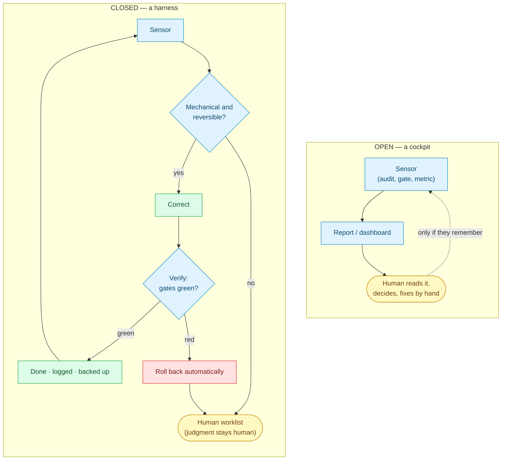
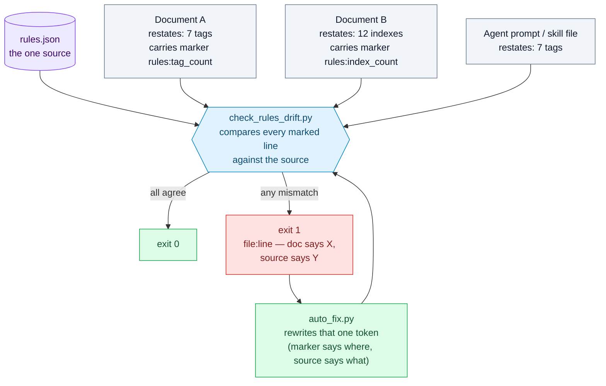
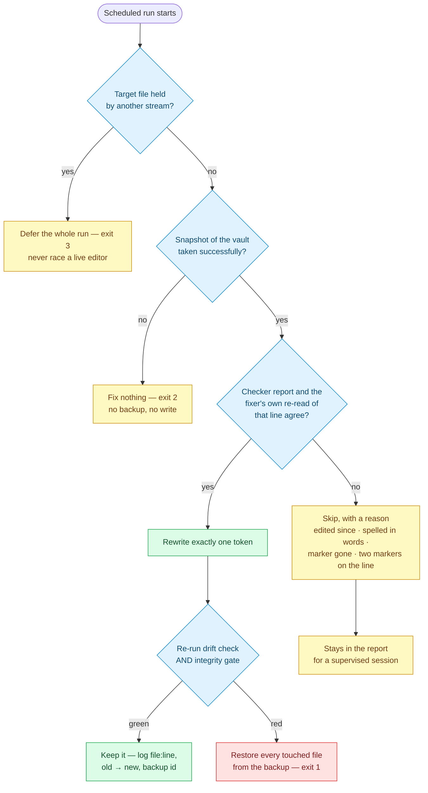
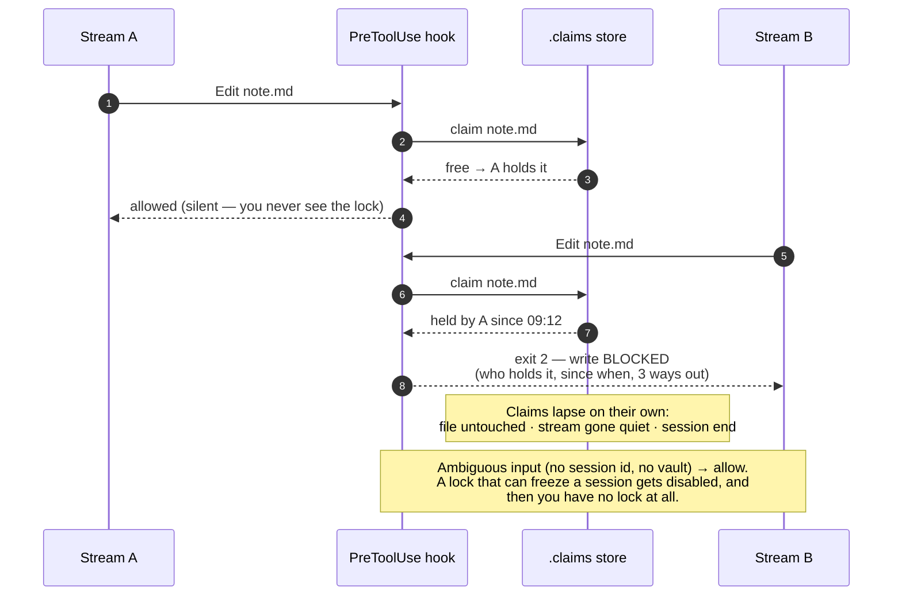
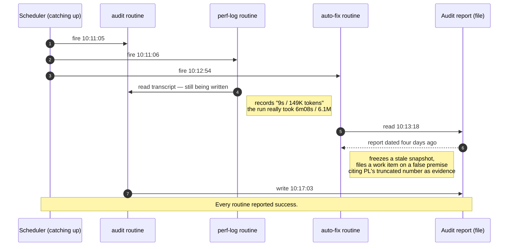
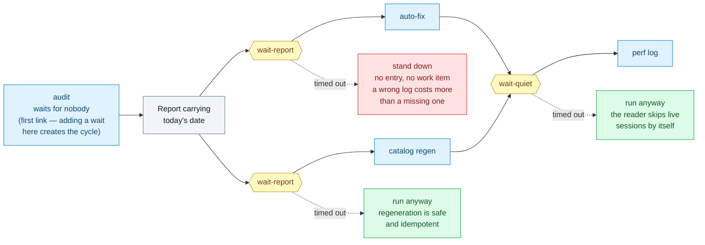

# The Self-Operating Knowledge Base — A Harness Blueprint

> This blueprint distills a working architecture for a knowledge base (KB) that maintains
> *itself*: correct, fresh, and fast for both humans and AI agents to retrieve from. It is
> deliberately tool-agnostic — the KB is just a folder of Markdown notes; the ideas apply
> whether you drive it with an editor, a script, or an autonomous agent.

*Provenance: this blueprint reflects a real working system as of **2026-07-25**. The concepts are
evergreen; any specific counts mentioned (e.g. tag or index totals) are illustrative snapshots
from that date, not live values.*

---

## 1. The goal: a KB that runs itself

**North star:** the KB preserves its own *correctness*, *freshness*, and *retrieval quality*
without a human steering every loop. The human becomes a *supervisor and approver of high-risk
changes*, not the *operator* of routine maintenance.

This is not automation for its own sake. It follows directly from the real goal of a KB an agent
depends on: **the agent must not miss data**. A KB whose rules contradict themselves, whose
indexes are stale, and whose links quietly break will lead an agent to triage wrongly and miss
what it needed. To guarantee "no missed data" as the KB grows, the quality-control loops must
**run and correct themselves** — they cannot depend on a human remembering to run them.

---

## 2. What "harness" really means

There are two senses of the word, and a maturing system sits at two different levels:

- **Sense 1 — agent scaffolding.** The runtime around a model: tools, permissions, hooks,
  feedback. Building a *second-order* harness on top of your agent runtime — activity logging,
  verification gates, coordination contracts — already puts you ahead of typical usage.
- **Sense 2 — the original sense (a harness on a powerful animal, a test harness, a safety
  harness).** The thing that makes a **powerful but unpredictable** engine **safe and reliably
  useful.** This is the level most systems never fully reach.

> **The defining property of a harness is not "many gauges." It is the CLOSED LOOP:**
> `sense deviation → decide → self-correct → verify → keep on rails`, running with minimal
> human intervention. A hundred dashboards where a human still fixes everything by hand is a
> **cockpit**, not a harness. A harness is when the system **pulls itself back onto the rails.**

---

## 3. The 7-property scorecard

Score any KB honestly. The first six properties are the *scaffolding*; the seventh is the
*essence*. Most effort — and most pride — goes into 1–6, which is exactly why 7 is the frontier.

| Property | What good looks like | Typical state |
|---|---|---|
| **Actuation** | Agent can read/write notes and run maintenance | Usually solved |
| **Observability** | Every action is logged and visible in real time | Often strong |
| **Guardrails** | Damage is prevented before it happens (gates, backups, safe entry points) | Often strong |
| **Determinism / self-healing** | Entry points are idempotent; a supervisor recovers from crashes | Achievable |
| **Automation** | Routine maintenance runs on a schedule without a human | Achievable |
| **Multi-agent coordination** | Multiple agents share the KB without clobbering each other | Usually by convention |
| **Closed control loop** | The system corrects itself; it does not only report | **Rarely reached** |

A common, honest self-assessment in a maturing system: near-complete on scaffolding and
guardrails, but only a fraction of the top-level loops actually close. You have built an excellent
*cockpit and safety rig*; what remains is letting the machine **hold itself on the rails**.

---

## 4. Diagnosing your loops: open vs. closed

For each maintenance concern, ask one question: **does it sense AND self-correct, or does it only
sense-and-report?** A loop that reports and stops is an *open* loop — a human is the final
actuator.

| Loop | Sensor | Self-corrects? | State |
|---|---|---|---|
| **Code/config changes** | test/self-check | Change → gate must pass → back up | Closed |
| **Retrieval catalog freshness** | note changes | Regenerate on schedule + on every edit | Closed |
| **Content integrity (audit)** | daily audit finds violations | Often intentionally read-only | **Half-open** |
| **Retrieval optimization** | metrics: re-reads, long chains, hot/cold notes | Nothing restructures automatically | **Open** |
| **Cost / performance** | per-run token/cost/time logs | Observe only | **Open** |

If most of your top-level loops sense-and-report, you have a cockpit. That is the line between
"a very rich instrumentation rig" and "a harness in the full sense."

The difference is one edge — the one that comes *back*:



Note what is *not* different: judgment still belongs to the human in both. Closing the loop does not
mean the machine decides more — it means the machine handles the cases where there was never a
decision to make.

---

## 5. The core architecture debt: a single source of truth

A recurring failure mode: **rules duplicated across many documents drift apart.** An audit that
checks the KB against its own rules will eventually catch its *rules* disagreeing with each other
— for example, one document might claim the tag vocabulary has 14 entries while another says 15,
or one counts 26 indexes and another 27. The audit catching the drift is good. But the drift **keeps recurring** because there
is no single generated source.

> **A real harness has exactly ONE source of truth.** Every countable, enumerable fact (the tag
> vocabulary, the number of indexes, the list of areas) is **generated from one source**;
> every other document *derives* from it — instead of five hand-copied versions slowly diverging
> and an audit chasing them every morning.

This is the highest-leverage, lowest-risk fix, and it is a prerequisite for safely automating any
*correction* (§6, §7). See `examples/rules/rules.example.json` for the data-as-source pattern and
`examples/scripts/verify_kb.py` for a gate that checks notes against that single source.



The documents keep showing the number — they just stop *owning* it. Without the marker, every one of
those boxes is an independent claim, and the audit's job degrades into comparing copies with copies.

### Documents may show the numbers - they just may not own them

The naive reading of "one source of truth" is to strip every count out of your prose. Do not: readers
and agents genuinely want "the vocabulary has 7 tags" in the document they are already reading. The
fix is not to delete the copy, it is to **stop letting the copy be authoritative**.

Mark each restating line with a comment naming the claim it makes:

```markdown
## Tag vocabulary (7 tags) <!-- rules:tag_count -->
## Index hierarchy (12 indexes) <!-- rules:index_count -->
```

The marker is an HTML comment: invisible when rendered, trivial to grep, and it survives editing by
humans and agents alike. A checker then reads each registered document, extracts the marked claims,
and compares them with the source - **policy** values as authored (vocabulary, areas) and
**filesystem** values as counted (index count). Drift is reported as `file:line`, so nobody has to
hunt for which of five copies is wrong. `examples/scripts/check_rules_drift.py` is a working
implementation; `examples/scripts/test_drift_check.py` breaks it on purpose to prove it catches drift.

Two properties matter more than the implementation:

- **The registry is explicit.** The rules file lists which documents restate which claims, so
  *deleting* a marker is itself an error. Drift cannot hide by removing the evidence.
- **Detection is separate from correction.** The checker never edits a document. It only makes the
  numbers impossible to break silently - which is exactly the precondition H2 needs before anything
  is allowed to rewrite them (§7, rule 4).

### The tooling has to live in the vault, not beside it

One source of truth applies to the *tools* as much as to the data. The tempting place to put a
generator or a checker is wherever your agent keeps its skills, or a config directory, or the folder
you happened to clone it into. All of those live **outside** the vault - and that single decision
quietly breaks three things at once:

- **The KB stops being self-sufficient.** A machine that has the vault but not the tool cannot
  regenerate the catalog or run the gate. Work done there silently degrades the KB: notes get added,
  derived artifacts go stale, and nobody notices until someone sits at the *other* machine.
- **The tool itself becomes a drift source.** Two machines, two copies, edited on different days.
  Same vault, two answers - and no way to tell which one is right.
- **It lands in the audit's blind spot.** The audit scans the vault. A checker outside the vault is,
  by construction, unchecked. We found a path constant that had been broken for a week inside exactly
  that gap: every session using it silently fell back to a slower, lossier retrieval route.

> **Rule: anything the KB needs in order to verify or regenerate itself belongs inside the KB**,
> versioned with the content it acts on, depending on nothing but a stock interpreter.

What may stay outside is narrow and specific: **secrets**, **large binaries**, and **per-machine
configuration** (paths, ports). A thin launcher or hook may live in machine config as long as it only
*calls into* the in-vault script and holds no logic of its own.

The scaling argument is the one that matters. With two machines you can patch by hand and remember
which is behind. At team or company scale, per-machine copies grow linearly while the chance that
they agree collapses: N machines is N chances for the gate to be missing, outdated, or subtly
different — and every one of those is invisible to an audit that only reads the vault. In-vault
tooling makes that class of failure structurally impossible instead of merely unlikely.

The test is blunt: **clone the vault onto a clean machine. Can you run the gate?** If the answer
requires installing something first, the tooling is in the wrong place.

One migration caveat, learned the hard way. When you move a generator into the vault, its output must
match the old one **field for field** — otherwise the two machines take turns rewriting the same
derived file and every sync becomes a diff. Port it, then run it in a compare mode against the
artifact the old tool produced and reconcile until only genuine content changes remain. Undocumented
conventions surface fast that way: slug truncation limits, whether headings include the H1, what a
missing frontmatter field defaults to.

### A gate nobody runs is not a gate

Moving the tooling inside the vault raises the next question immediately: those scripts have tests —
**who runs them?** If the answer is "whoever remembers", you have written documentation, not a gate.
A suite nobody runs does not fail loudly; it stops being evidence, silently, and you discover months
later that the check you trusted has been vacuous for weeks.

Wire the suites to something the runtime already does. An end-of-turn hook works well: it is
frequent, it is automatic, and it is a natural place to refuse — *this turn is not finished while a
tool you just edited has a failing test.* `examples/scripts/tooling_selfcheck.py` is that gate, and
four properties are what make it survivable rather than merely strict:

- **Discover the suite, never list it.** Anything matching `attachments/test_*.py` is in. A list you
  must remember to append to is the same failure mode one level up — and hand-maintained file lists
  have already bitten this project twice.
- **Do nothing when nothing changed.** Fingerprint every tooling file (tools included — editing a
  tool invalidates yesterday's green run as much as editing its test) and compare against the last
  **green** run. The common path costs a fifth of a second, which is why nobody wants it removed.
- **A red run must not record success.** Otherwise the gate goes quiet immediately after the first
  failure, precisely when it should be loudest.
- **Fail open, and never trap.** Unknown input, no vault, runner crash → allow. Already blocked once
  this turn → report but let it end. A gate that can strand a session is a gate someone disables
  permanently, and then you have nothing.

The bug that made all this concrete: an early version accepted `--vault` without validating it. A
mistyped path found no suites, reported green, and wrote a green marker — after which the gate stayed
silent forever. **The dangerous failure mode of a gate is not a false alarm, it is quiet
reassurance.** Test for that case explicitly.

### A test that breaks a real document must be able to put it back — or shout

Contract-breaking tests are the ones worth having: they corrupt a number, run the checker, and demand
it goes red. The temptation is to run them against the **real** documents, because that is what
proves the production path works end to end. The cost is easy to miss. Such a test is, for a few
milliseconds at a time, a process that deliberately writes wrong data into your source of truth — and
the only thing standing between that and a corrupted vault is a `finally` block.

`finally` is not a guarantee. It is ordinary code that can fail like any other, and on a synced
folder it fails for a boring reason: the file is locked. A sync client is uploading it, an editor has
it open, another process is holding it. The restore raises, the test moves on, and the document stays
wrong.

This is not hypothetical. It happened twice in the source project. The second time, the damage was
measured precisely: the suite lowered a tag count by one **inside the rules document itself** and
left it there. Every visible signal stayed plausible — two suites red, which they had been for days.
Nothing said *the constitution has been edited.* It was only caught because of a habit written down
after the first occurrence: **when the tooling gate goes red, immediately run the drift checker** —
not to see which suite failed, but to see whether the suites left the vault dirty.

Two ways out, in order of preference:

- **Sandbox it.** Copy the fixture vault into a temp directory and break the copy. Nothing real is
  ever at risk, and the test can be as violent as it likes. This is what `test_auto_fix.py` in this
  repo does, which is why the repo never had this bug. Prefer this whenever the fixture can
  faithfully stand in for the real thing.
- **Guard it,** when the whole point of the test is that it exercises real production data and a
  fixture would quietly diverge from it. Then the restore path needs three things it almost never
  has by default:
  1. **Snapshot to disk, outside the vault, before breaking anything.** An in-memory copy dies with
     the process; a copy on disk lets the *next* session repair what this one abandoned. Write a
     manifest next to it so recovery needs no guesswork.
  2. **Restore atomically, and retry.** Write to a temp file beside the target and rename over it, so
     a kill mid-write cannot leave a half-file. Then retry on `PermissionError` with a growing wait —
     a sync client usually releases within seconds. Give up only after that.
  3. **Verify at the end, and be loud when you fail.** Compare bytes against the snapshot; if
     anything still differs, say so on stderr with the recovery path and the exact restore command,
     and raise the exit code. A test that quietly leaves damage behind is worse than a test that
     fails, because a failure gets investigated.

One more trap, cheap to avoid: build each case's broken content from the **snapshot**, never from
what is currently on disk. Read the file back and one failed restore silently becomes the "original"
for every case that follows.

The general rule this belongs to: **a mechanism that writes must be judged by what happens when its
cleanup fails, not by what happens when it succeeds.** The auto-fixer in H2 earns its keep through
its refusals; a destructive test earns its keep through its restore path. Both are only as good as
the path nobody watches.

### Measure the curve, not the snapshot

A knowledge base that an agent maintains does not fail abruptly. It degrades: notes accumulate,
newer ones compete with older ones for the same query, the folder a fact lives in slowly stops
matching what the fact is about. Every individual step looks fine. That is exactly why a single
measurement cannot find it — a snapshot tells you today's number, and today's number always looks
reasonable in isolation.

Most projects already own the instruments and never notice they are being used wrong. Ours did: a
retrieval self-test last run at 74 notes, a graph-health report last run at 144, a cost log measuring
*per scheduled job* rather than per unit of store. Three readings, three different weeks, three
different scales — and no way to answer the only question that matters: **is this getting better or
worse as it grows?**

Fix the axis, not the instruments. Record one row per measurement — date, store size, answer quality,
retrieval **cost**, structural health — append it to a data file the machine owns, and render it as a
table. Four properties make the difference between a log and a curve:

- **Size is the x-axis, not time.** "Cost went up in August" invites excuses. "Cost went up between
  74 and 163 notes" is a claim you can act on.
- **Show the delta, not just the value.** Absolute numbers sit inside their thresholds for a long
  time while quietly drifting toward them. The eye should land on the change.
- **Record the bad runs too.** A curve that only gets written when the gate is green is a curve that
  documents nothing. Ours writes the point and reports the failing gate alongside it.
- **Missing is not zero.** Backfilled points from an old log, and columns an instrument could not
  produce, must render as *unknown* and be marked as such. A fabricated cell is worse than a blank
  one: blanks are honest about the horizon, fabrications poison every comparison drawn across them.

Two traps worth naming. First, if a metric already exists elsewhere, **import the function, do not
reimplement the calculation** — two tools counting the same store and disagreeing is a failure this
project has hit repeatedly, and it is worst when the two numbers happen to coincide by accident.
Second, resist gating on the curve the moment you have it. The curve is evidence; choosing the
threshold that turns evidence into a refusal is a judgement call, and it belongs to a person.

The payoff is a question the loop could not previously answer at all. The framing is not ours: it
comes from Zhou et al., *Filesystem-Based Memory for LLM Agents: Organization, Evolution, and
Sustainability* ([arXiv:2607.26637](https://arxiv.org/abs/2607.26637)), which measures answer
quality, cost, and store health *as functions of store size* rather than at a point. Their finding
is the reason the headline column here is cost rather than correctness: organised stores roughly
halve retrieval cost on large material, while answer quality barely moves — *"quality benchmarks
remain largely blind to shape."* A metric blind to the thing you are trying to protect makes a poor
alarm, however reassuring it looks.

---

## 6. Roadmap: closing the loops

Not "add more gauges" — **close the loop.** Ordered by return-on-investment vs. risk.

### H1 — One source of truth for enumerable rules  ⭐ *(do this first; reference implementation included)*
Put every countable fact (tag vocabulary, area list, index count) in **one data file**. Make every
document *derive* from it, and have the audit compare notes against that source directly rather
than comparing hand-copied lists against each other. This kills the entire class of "14 vs 15"
drift at the root.

**Shipped here:** `examples/rules/rules.example.json` (the source, with a registry of which documents
restate which claims) + `examples/scripts/check_rules_drift.py` (the checker, exit 1 on drift) +
`examples/scripts/test_drift_check.py` (break-the-gate tests). See §5 for the marker pattern.
Wire the checker into the daily audit and the class of drift stops being something a human notices.

### H2 — Promote the audit from "report" to "safe auto-fix"  *(reference implementation included)*
For **mechanical, reversible** errors (broken links, missing frontmatter fields, count mismatches,
orphan images), let the audit **fix + back up + log + keep a rollback path.** Keep everything that
requires *judgment* (translation, semantic tag classification, note structure) strictly read-only.

**Shipped here:** `examples/scripts/auto_fix.py` (fixes marked count claims, backs up, re-gates,
rolls back) + `examples/scripts/test_auto_fix.py` (break-the-fixer tests) +
`examples/routines/kb-autofix-daily.SKILL.md` (the scheduled run that follows the audit). Four
decisions are the whole design:

- **Open exactly one class first.** A number on a line that carries a marker: the marker names the
  claim, the rules file supplies the value, and one token changes. The fixer never has to understand
  the sentence it edits — which is the property that makes it safe, and the property most
  "auto-repair" features quietly lack.
- **Two independent sources must agree.** The checker reports `X -> Y`; the fixer re-reads that line
  and must find token `X` there itself, using the claim's own pattern. Line edited since, number
  spelled out in words, marker gone → skip with a reason. There is no branch that guesses, because
  a wrong "fix" written confidently into the constitution is worse than an unfixed report.
- **The gate decides whether the fix counts.** Write, then re-run the drift check *and* the
  integrity gate. Either red → restore every touched file from the backup taken seconds earlier and
  exit non-zero. Rollback is not a manual escape hatch you hope works; it is on the normal path and
  has a test that forces it.
- **Refusals are part of the contract, not gaps.** Incomplete enumerations (what to insert, worded
  how), removed markers (deliberate or lost?), and anything semantic stay in the report. Widening
  the list is a decision to make in daylight — never a flag on the command line.

Every one of those decisions is an exit that does **not** write:



The rollback edge is not an escape hatch you hope works: `test_auto_fix.py` forces a gate red on
purpose and asserts every touched file came back.

Two operational notes, both learned the hard way in the first day of review:

- **Pair it with the per-file lock (H4)** if more than one stream writes — and *hold* the lock, do
  not merely ask. A checked-then-written file is a race with a polite name; shell writes never pass
  through the tool hook, so nothing else is holding it for you. A file another stream holds should
  defer the entire run rather than race it: an auto-fixer that fights a live editor is a corruption
  engine with good intentions.
- **Attribute numbers by marker position, in the checker.** Matching patterns across the whole line
  hands every marker of that unit the leftmost number, so the *report itself* is wrong before any fix
  is attempted; the fixer can only refuse such lines. Give each marker the text from the previous
  marker up to itself and the ambiguity disappears at the sensor — a sensor whose ambiguity a
  downstream tool has to work around is a sensor with a bug, and "keep one marker per unit per line"
  was a rule invented to protect the tool from itself. Note the one case a duplicate-target check
  cannot cover: when both numbers on the line are *already equal*, only one fix is planned, nothing
  overlaps, and a fixer that re-searches the whole line quietly rewrites the number that was right.

### H3 — Turn retrieval signals into actions
Metrics (frequently re-read notes, long retrieval chains, isolated hot notes) currently just sit on
a dashboard. Close the loop by **generating suggestions** — "link notes A and B", "merge two notes
on the same topic", "note X is an orphan, add it to an index" — into an actionable worklist, instead
of waiting for a human to read the dashboard and infer the fix.

### H4 — Mechanical coordination instead of convention  *(reference implementation included)*
If multiple agents/sessions share the KB, replace "please check the version before editing" with a
**mechanical lock** (a lock file / per-file claim). This turns a social contract into a hard
guardrail and ends the class of bugs where two parallel streams clobber each other.

**Shipped here:** `examples/scripts/claim.py` (per-file claims + a `PreToolUse` hook that exits 2 to
block the write) + `examples/scripts/test_claim.py` (break-the-lock tests) + the hook wiring in
`examples/hooks/settings.json`. Four design decisions are the whole story:

- **One claim file per stream, never a shared one.** Vaults live in synced folders; two machines
  appending to a single lock file is how you manufacture conflict copies and lost updates — the
  exact failure the lock exists to prevent. Writers never touch each other's files.
- **Conflicts are resolved from data, not from write order.** Among live holders, the earliest
  `since` wins; every process reading the same files reaches the same verdict. Claiming is
  write-then-verify, so in a close race the loser withdraws instead of both sides believing they
  hold the file.
- **Silent when you work alone, loud only on a real collision.** A free file is claimed with no
  output; the lock is invisible until it saves you. Claims lapse on their own (untouched file, or a
  stream gone silent), so nothing has to be cleaned up by hand.
- **It fails open.** Malformed payload, missing session id, no vault found → allow the write. A
  lock that can freeze an agent session will be disabled by the first person it inconveniences, and
  then you have no lock at all.



Two limits worth stating out loud, because a lock people over-trust is worse than none: across
machines the guarantee is only as fast as your file sync, and only the agent's *file tools* pass
through the hook — shell commands, scripts and desktop editors do not (deliberately: a human
editing their own notes should never be blocked).

### H4b — The order between scheduled routines is coordination too  *(reference implementation included)*
H4 keeps two writers off the same file. There is a second, quieter half of the same problem: your
daily routines have a **dependency order**, and in most setups the only thing enforcing it is the
gap between their cron times.

The audit writes a report; the fixer consumes that report; the catalog regeneration rewrites files
the audit measures; the performance log reads the *session transcripts* of all of them. "08:00 <
08:20 < 08:30 < 08:45" is not a guardrail — it is an assumption about the environment, and the
environment only has to slip once.

**How ours slipped.** The agent app sat closed past every cron slot and was reopened mid-morning.
The scheduler fired **all five overdue routines within two minutes**, in an order unrelated to
their cron times. Three failures landed at once, and every routine reported success:

- the fixer read the audit report **four minutes before the audit wrote it**, froze a four-day-old
  snapshot into the handling log, and filed a work item on a false premise;
- the performance log started one second after the audit and scanned a transcript still being
  appended to, recording *"audit: 9s / 149K tokens"* for a run that actually took 6m08s / 6.1M —
  and that truncated number then travelled as evidence into the work item above;
- the catalog regeneration rewrote the file the audit was measuring at that moment.



Worth stating plainly, because it generalises past scheduling: **a truncated measurement is more
dangerous than a missing one.** A missing row announces itself. A row with a session id, a token
count and a timestamp looks exactly like a fact, and gets used like one.

Two more things this exposed. First, the collision was never only about the outage: schedulers add
jitter, and ours pushed the fixer (cron 08:20) to ~08:30 and the logger (cron 08:30) to ~08:31 —
one minute apart, for a routine that runs three to four. The logger had been recording a truncated
row for the fixer *every morning*, self-healing a day later only because the ledger overwrites by
session id. Second, the fix is not "spread the cron times further apart": any gap collapses the
same way.

**Shipped here:** `examples/scripts/routine_guard.py` + `examples/scripts/test_routine_guard.py`,
plus the wiring in the routine templates. Design decisions:

- **Wait on data, not on a lock.** `wait-report` blocks until the audit report carries today's
  date — the very fact the downstream routine has to establish anyway. A lock would need the
  upstream routine to cooperate with begin/end, and a routine that dies mid-run (they do) leaves an
  orphan lock; then you need lock expiry to repair your lock. Data does not lie.
- **Only downstream waits.** No routine upstream ever waits on something downstream, so there is
  no wait cycle and deadlock is impossible by construction. The audit template says this out loud,
  because "let's make the audit wait for the catalog too" is the one edit that would create it.
- **Liveness for the reader.** The log routine has no data signal to wait on, so `wait-quiet`
  watches transcript mtimes and returns once no other scheduled run has written for `--idle`
  seconds. Interactive human sessions are excluded by marker — a logger that mistakes your own chat
  for a routine waits until timeout, every time.
- **Fail-open and fail-closed in opposite directions.** Cannot read the sessions directory →
  proceed (blocking the logger forever is worse than one row that heals next run). Cannot read the
  report → **stand down** (proceeding without knowing whether the upstream stage ran is precisely
  how the wrong conclusion got written).
- **Defence in depth at the reader.** The guard is discipline at the prompt layer; the transcript
  reader independently skips sessions written to within the last 90s. The two thresholds have an
  invariant — idle (180s) must exceed in-flight (90s), or the guard says "all quiet, go" while the
  reader still skips that session and the row silently vanishes for a day. A test holds that line,
  not a comment.

The same five routines, with the order restored — and note that each timeout has a *different*
right answer:



*(Optional, later — H5: feed the cost/performance logs into a threshold that warns or suggests a
cheaper model when a scheduled run exceeds its token budget.)*

---

## 7. Safety: how far to automate the "fix"

> **A read-only audit is the RIGHT instinct, not unfinished work.** You must never let an agent
> silently rewrite the KB's constitution at 8 a.m. The remaining distance to a full harness is not
> "work left undone" — it is a design question: *how far do you dare automate the correction, and
> with what guardrails?* The real meaning of "harness" lives precisely here.

Safety rules for closing any correction loop (applies to H2/H3):

1. **Only auto-fix MECHANICAL + REVERSIBLE errors.** Anything requiring semantic judgment stays
   read-only and goes to a worklist for a supervised session.
2. **Every auto-fix must: back up first, log the change, and keep a rollback path.** Never fix
   silently.
3. **Idempotent + gated.** After an auto-fix, the integrity gate must report zero problems for the
   fix to count as a closed loop; on failure, roll back and alert a human.
4. **A single source of truth (H1) is a prerequisite** for auto-fixing counts — without it, an
   auto-fix can "correct" toward a wrong copy.

---

## 8. Acceptance criteria — "harness, not cockpit"

The KB qualifies as a harness in the full sense when these are **measurable**:

- [ ] **Zero drift:** enumerable facts no longer disagree between documents — the audit reports
      zero "count/enumeration" conflicts for 30 consecutive days (via H1).
- [x] **At least one class of mechanical error is auto-fixed** by the audit (no manual session),
      with a log and a rollback proving it is safe (via H2 — marked count claims; the rollback path
      is exercised by a test that forces the post-fix gate red).
- [ ] **Retrieval signals become an actionable worklist**, not just a dashboard (via H3).
- [ ] **Multi-agent access uses a mechanical lock**, not discipline (via H4).
- [ ] **Every operational loop has all five stages:** sensor + threshold + action + verification +
      rollback.

When all five are green, the human is genuinely reduced to *supervising and approving high-risk
changes* — the definition in §1.

---

## Appendix: the loop, as a checklist

Any maintenance concern you want to "harness" should be able to answer all five:

1. **Sensor** — what detects the deviation, and how often?
2. **Threshold** — what counts as "out of bounds"?
3. **Action** — what correction fires automatically?
4. **Verification** — how do you confirm the correction worked (a gate that can fail)?
5. **Rollback** — how do you undo it safely if verification fails?

If you can only answer 1 and 2, you have a gauge. All five is a harness.
